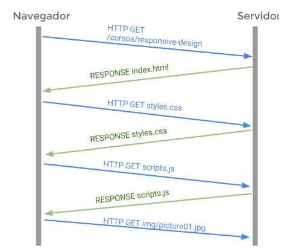

# Arquitecturas y lenguajes de programación

## Contenidos
- [Proceso de carga de una página web](#proceso-de-carga-de-una-página-web)
- [Lenguajes de scripting](#lenguajes-de-scripting)

## Proceso de carga de una página web

### Etapas
1. __Latencia__: el tiempo que tardas en conectarte a tu proveedor de internet.
2. __Petición DNS__: el navegador envía una petición al servidor de nombres (DNS).
3. __Redirecciones__: Las redirecciones añaden tiempo al proceso de carga de una web aunque sean dentro del mismo dominio.
4. __Peticiones HTTP__: Se realizan las debidas peticiones HTTP. (Ver imagen)

     
    Proceso de peticiones HTTP.

5. __Respuesta HTML__: Después de que el servidor reciba la petición HTTP, éste devuelve al navegador la página HTML correspondiente. La respuesta también tiene una cabecera, y en ella puede haber información sobre si se permite “CACHEAR” el recurso y el tiempo que puede ser.
6. __Descompresión__: Los ficheros HTML, JavaScript y CSS pueden enviarse comprimidos desde el servidor usando GZIP. Esto hace que pesen menos y su tiempo de descarga se reduzca. El navegador al enviar la petición HTTP, lleva en sus cabeceras información sobre esto.
7. __Carga del DOM__: En el siguiente paso el navegador se encargará de formar el DOM (Document Object Model) a partir del contenido HTML que recibe. El DOM no es más que una representación en forma de árbol de nodos de la estructura de nuestra página HTML.
8. __Renderizado del HEAD__: Cuando el DOM está listo, el navegador comienza a renderizar el HTML, elemento a elemento, empezando por el contenido de la etiqueta `<head>`. Cada vez que el navegador encuentre un enlace a un fichero (como puede ser un fichero CSS, JavaScript, imagen, etc.) se realizará una petición HTTP.
9. __Renderizado del BODY__: Cuando finaliza el renderizado del `<head>` comienza la parte del contenido. De igual manera que en el `<head>` va pintando uno a uno los elementos que va encontrando También se van aplicando las reglas CSS que tenga cada elemento para poder colocarlo en la pantalla y ver cuál será su aspecto final.
10. __Eventos__: Cuando finalmente se ha renderizado el documento, el navegador dispara el evento __ONLOAD__. Si tenemos algún script que escuche ese evento, en este momento se ejecutaría.

## Lenguajes de scripting

__¿Qué es un script?__ Un bloque de código que puede insertarse en medio de un documento. Este código suele ser interpretado comando a comando (como un guión) y por lo tanto no es
habitual que se escriba en un lenguaje compilado sino en un lenguaje interpretado. __Para que esto funcionara__ y el lenguaje de scripting pudiera manipular la propia página web fue necesario primero crear una estructura de objetos de la propia página web. Es decir, si en el código HTML de una página hemos incluido una lista ordenada y tres botones necesitaremos un mecanismo para identificar a cada uno de estos elementos de alguna manera. Esto se llamó el __DOM (Modelo de Objetos del Documento)__ y nuestro lenguaje de scripting puede utilizarlo para realizar su tarea.

### Ejemplos de lenguajes de scripting en cliente web

- __JavaScript__: es actualmente el líder indiscutible en los clientes web. Hereda su sintaxis del C++ aunque su nombre induce a muchos a pensar que es una versión de Java (cosa que no es cierta). No obstante, y dado que Java también hereda gran parte de su sintaxis del C++, comparte con Java la forma de escritura.
- __VBScript__: es el lenguaje de scripting desarrollado por Microsoft. Fue el principal competidor de JavaScript pero terminó cayendo en desuso con el auge de otros navegadores Web.
- __JScript__
- __ECMAScript__
- __ActionScript__

