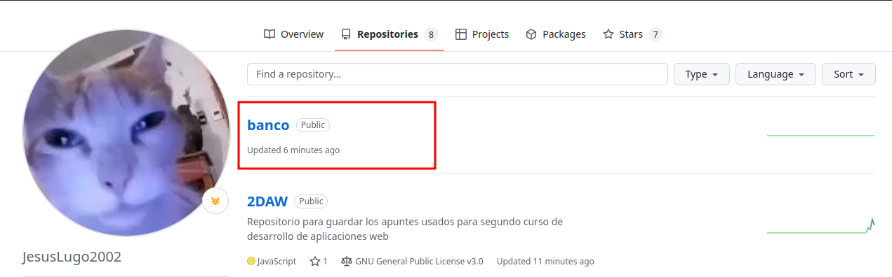
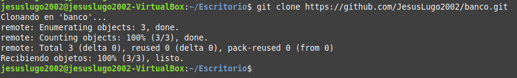
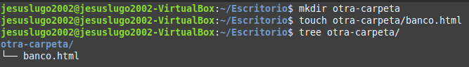
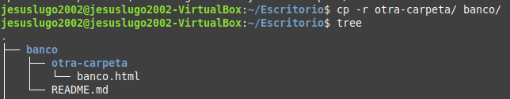
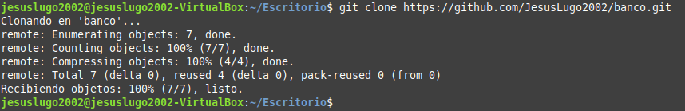
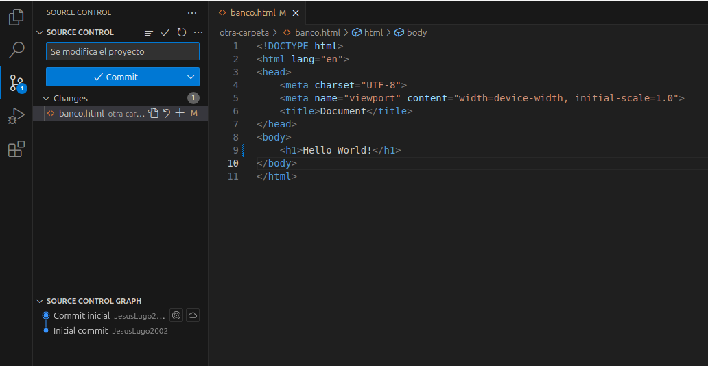

# Trabajando con con el Visual Studio y nuestro repositorio en Github

### Crea un repositorio llamado “banco”

    

### Clona el repositorio desde la linea de comandos

    

### En otra carpeta crea un proyecto llamado “banco”

    

### Copia la carpeta del proyecto del banco a la carpeta en la que has clonado el repositorio.

    

### Haz un commit y push desde Visual Studio.

    

### Borrar del disco duro todo el código del banco

Se borra todo el código y los ficheros de __banco__ con `rm -rf banco/`.

### Clona el proyecto del banco de github a local

    

### Haz una modificación del código y subelo a GitHub

    

