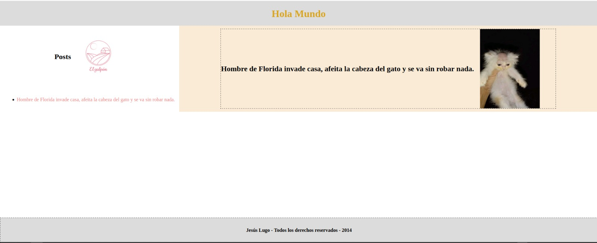
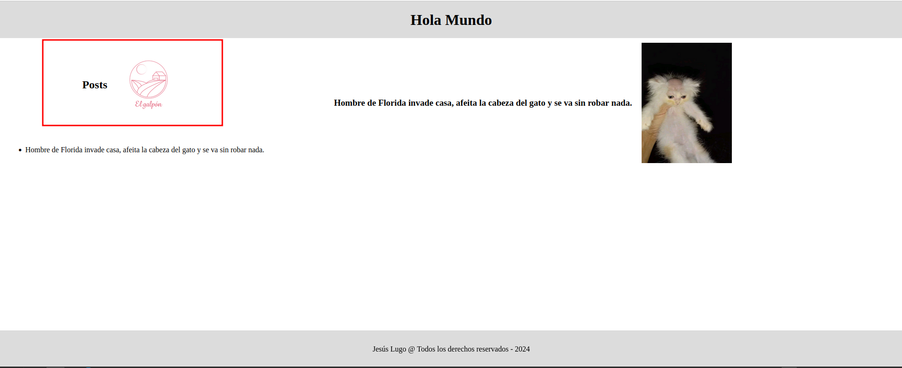
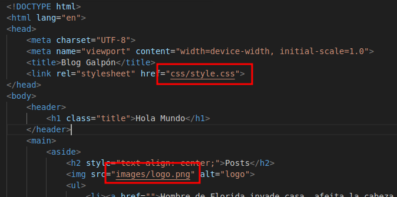

# Trabajando con Git y Markdown 3

<div align=center>
    
</div>

#### Creo un directorio de trabajo llamado /bloggalpon/ en el directorio del usuario.

```sh
mkdir bloggalpon
```

#### Inicializar el repositorio vacío.

```sh
cd bloggalpon/ && git init
```

#### Crear el archivo index.html

```sh
touch index.html
```

#### Añadir la estructura básica de una web.

<div align=center>
    
</div>

#### Crear un commit indicando que se crea el esqueleto básico del index.html

```sh
git add . && git commit -m "Se crea el esqueleto básico del index.html"
```

#### Añadir el contenido al head, entre <head> y </head>.

```html
<head>
    <meta charset="UTF-8">
    <meta name="viewport" content="width=device-width, initial-scale=1.0">
    <title>Blog Galpón</title>
</head>
```

#### Crear un commit indicando que se añade la cabecera del index.html

```sh
git add . && git commit -m "Se añade cabecera al index.html"
```

#### Añadir el contenido al body, entre <body> y </body>

```html
<body>
    <h1>Hola Mundo</h1>
    
</body>
```

#### Crear un commit indicando que se añade la estructura básica del body.

```sh
git add . && git commit -m "Se añade body al index.html"
```

#### Añadir el contenido de section, entre <section> y </section>

```html
<body>
    <h1>Hola Mundo</h1>
    
    <section>
        <h2>Posts</h2>
    </section>
</body>
```

#### Crear un commit indicando que se añade toda la estructura de la zona de posts.

```sh
git add . && git commit -m "Se añade estructura de la zona de posts"
```

#### Crear un archivo style.css.

```sh
mkdir css && touch css/style.css
``` 

#### Añadir la siguiente información.

```css
body {
    margin: 0;
    font-family: 'Times New Roman', Times, serif;
}
```
#### Crear un commit indicando que se añaden las CSS de html y de body.

```sh
git add . && git commit -m "Se añade css al body"
```

#### Añadir la siguiente información.   

```css
header {
    position: fixed;
    display: flex;
    justify-content: center;
    align-items: center;
    height: 10vh;
    width: 100%;
    background-color: gainsboro;
}

main {
    padding: 10vh 0px;
    display: flex;
}

aside {
    width: 30%;
}

section {
    width: 70%;
    display: flex;
    justify-content: center;
}

article {
    margin: 10px;
    align-items: center;
    width: 80%;
    display: flex;
    gap: 20px;
}

article img {
    width: 10vw;
}

footer {
    display: flex;
    position: fixed;
    bottom: 0;
    width: 100%;
    background-color: gainsboro;
    height: 10vh;
    justify-content: center;
    align-items: center;
}
```

#### Crear un commit indicando que se añaden las CSS de varios elementos HTML5: header, section, article, aside y footer.

```sh
git add . && git commit -m "Se añade css a elementos semánticos"
```

#### Añadir en el directorio raíz de proyecto el logotipo que aparecerá en la barra lateral izquierda: logo.png

<div align=center>
    
</div>

#### Crear un commit indicando que se añade el logotipo de Galpón.

```sh
git add . && git commit -m "Se añade logotipo de Galpón"
```

#### Añadir la siguiente información.

```css
section {
    width: 70%;
    display: flex;
    justify-content: center;
    background-color: antiquewhite; /* Novedad */
}
```
#### Crear un commit indicando que se añaden las CSS de section.

```sh
git add . && git commit -m "Se añade css a section"
```

<div align=center>
    
</div>

#### Añadir la siguiente información.

```css
footer {
    display: flex;
    position: fixed;
    bottom: 0;
    width: 100%;
    background-color: gainsboro;
    height: 10vh;
    justify-content: center;
    align-items: center;
    font-weight: bold; /* Novedad */
    transition: 0.5s; /* Novedad */
}

/* Novedad */
footer:hover { 
    background-color: rgb(163, 163, 163);
}
```

#### Crear un commit indicando que se añaden las CSS del footer.

```sh
git add . && git commit -m "Se añade css al footer"
```

#### Añadir la siguiente información.

```css
h1 {
    color: goldenrod;
}

a {
    text-decoration: none;
    color: lightcoral;
}

a:hover {
    color: lightblue;
}
```

#### Crear un commit indicando que se añaden las CSS del H1 y de los enlaces.

```sh
git add . && git commit -m "Se añade css al H1 y los enlaces"
```

#### Crear una etiqueta de v1.0

```sh
git tag -a v1.0
```

#### Crear una rama “desarrollo”. En esta rama de desarrollo vamos a realizar varias tareas:

```sh
git branch desarrollo && git checkout desarrollo
```

#### Crear un directorio de images y mover allí el logotipo logo.png.

```sh
mkdir images
mv logo.png images/
```

#### Crear un commit indicando que se mueve el logotipo a la carpeta images.

```sh
git add . && git commit -m "Se mueve logotipo a la carpeta images"
```

#### Crear un directorio de CSS y mover allí las CSS style.css.

```sh
mkdir css
mv style.css css/
```

#### Crear un commit indicando que se mueve la CSS a la carpeta CSS.

```sh
git add . && git commit -m "Se mueve style.css a su carpeta correspondiente"
```

#### Cambiar las referencias a la CSS en el index.htm y al logotipo logo.png en la CSS.

<div align=center>
    
</div>

#### Crear un commit indicando que se cambian las referencias a las CSS y a las imágenes al reorganizarlas en directorios.

```sh
git add . && git commit -m "Se cambian las referencias a style.css y logo.png"
```

#### Crear una rama “bugfix” a partir de la “master” para resolver una serie de fallos.

```sh
git checkout master
git checkout -b bugfix master
```

#### Crear un commit indicando que introducen los punteados en la barra derecha y en el footer.

```css
article {
    border: 1px dashed black; /* Novedad */
    margin: 10px;
    align-items: center;
    width: 80%;
    display: flex;
    gap: 20px;
}

footer {
    display: flex;
    position: fixed;
    bottom: 0;
    width: 100%;
    background-color: gainsboro;
    height: 10vh;
    justify-content: center;
    align-items: center;
    font-weight: bold;
    transition: 0.5s;
    border: 1px dashed black; /* Novedad */
}
```

#### Introducir como título “Galpon”.

```html
<head>
    <meta charset="UTF-8">
    <meta name="viewport" content="width=device-width, initial-scale=1.0">
    <title>Galpón</title> <!-- Novedad -->
    <link rel="stylesheet" href="css/style.css">
</head>
```

#### Crear un commit indicando que se introduce el título en la página.

```sh
git add . && git commit -m "Se introduce título en la página"
```

#### Cambiar 2024 por 2014 en el footer. Quitar @.

```html
<!-- Antes -->
<footer>
    Jesús Lugo @ Todos los derechos reservados - 2024
</footer>

<!-- Después -->
<footer>
    Jesús Lugo - Todos los derechos reservados - 2014
</footer>
```

#### Crear un commit indicando que se realizan pequeños ajustes en el footer.

```sh
git add . && git commit -m "Se realizan pequeños ajustes en el footer"
```

#### Crear una etiqueta de v1.1

```sh
git tag -a v1.1 -m "Versión 1.1"
```

#### Llevar estos cambios a la rama “master”.

```sh
git checkout master
git merge bugfix
```

#### Borrar la rama “bugfix”.

```sh
git branch -d bugfix
```

#### Llevar los cambios de la rama “desarrollo” a la rama “master”. Resolver los conflictos, si existen.

```sh
git merge desarrollo

# Auto-fusionando css/style.css
# CONFLICTO (contenido): Conflicto de fusión en css/style.css
# Auto-fusionando index.html
# Fusión automática falló; arregle los conflictos y luego realice un commit con el resultado.

git add . && git commit -m "Se resuelven conflictos"
```

#### Crear una etiqueta de v1.2

```sh
git tag -a v1.2 -m "Versión 1.2"
```
