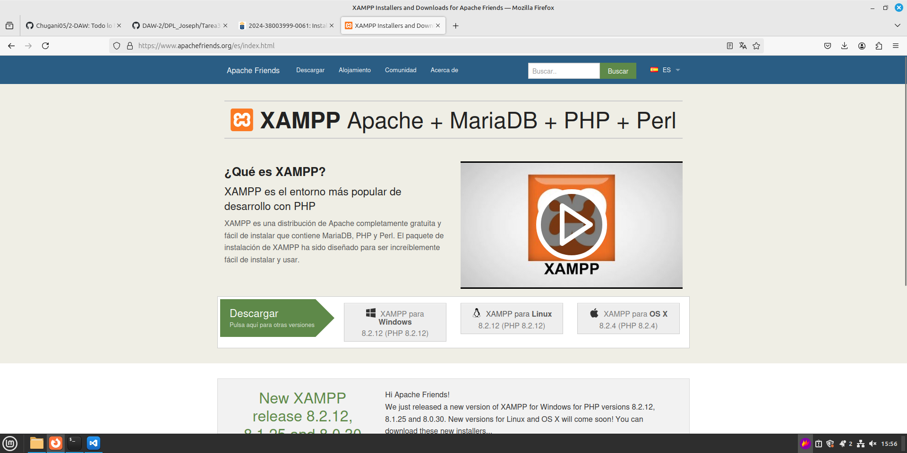
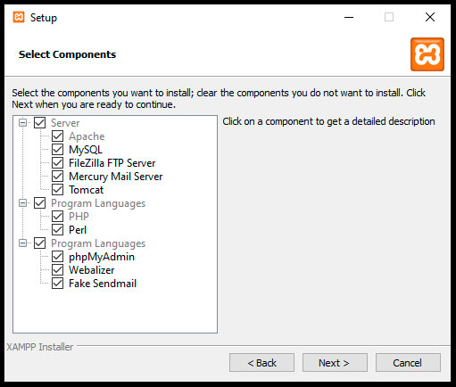
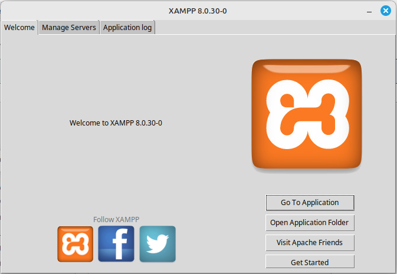
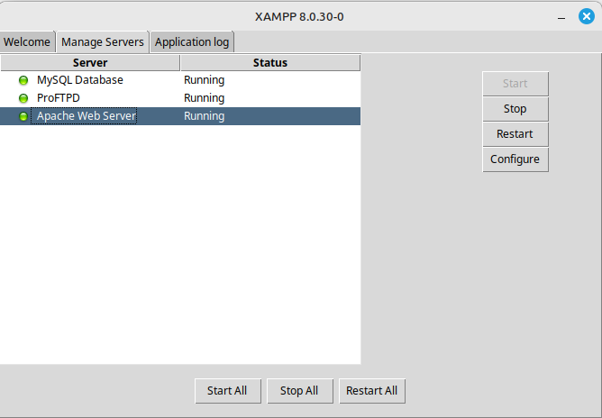
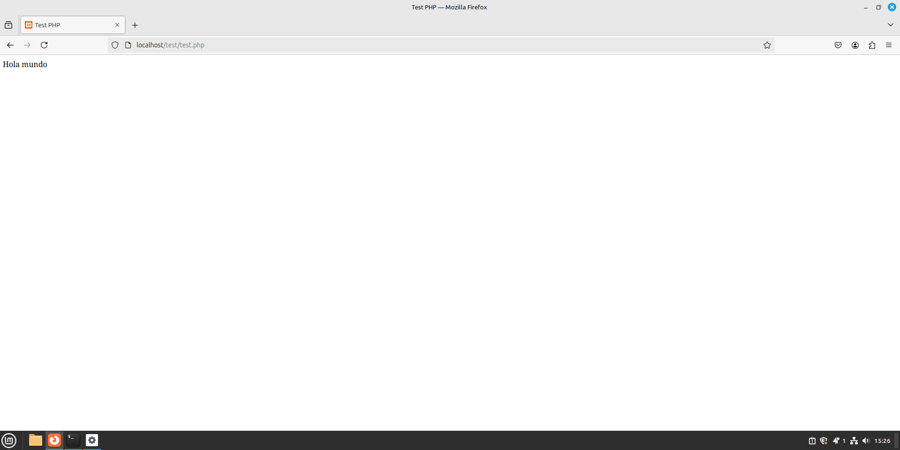

# Instalación, configuración y comprobación de XAAMP

<div align=justify>

<div align=center>
    
</div>

## Descarga e instalación

Primero nos vamos a la página web donde encontramos los archivos de descarga del software para distintos sistemas operativos y descargamos el deseado:

<div align=center>
    
</div>

Luego con el instalador descargado, lo ejecutamos y seleccionamos posteriormente los componentes a instalar:

<div align=center>
    
</div>

<div align=center>
    
</div>

Después de instalar el paquete de XAAMP indicado, comprobamos la instalación correcta abriendo el panel con el comando:
```
sudo /opt/lampp/manager-linux-x64.run
```
<div align=center>
    
</div>
<div align=center>
    
</div>

Ahora procedemos con la comprobación: __se debe crear un fichero test.php y mostrarlo en el servidor__. Para ello debemos dirigirnos al directorio __htdocs__ de los ficheros del servidor.

1. Nos vamos al directorio `/opt/lampp/htdocs/test` (la carpeta 'test' no está creada; debemos crearla con `mkdir test`)
2. Con el comando `nano test.php` accedemos al editor de texto de _nano_ y pegamos este código para mostrar un _Hola Mundo_.

```php
<html>
    <head>
            <title>Test PHP</title>
    </head>
    <body>
            <?php echo '<p>Hola mundo</p>'; ?>
    </body>
</html>
```

3. Tras iniciar los servidores desde el panel de control de __XAAMP__, accedemos al sitio web desde __localhost/test/test.php__.

<div align=center>
    
</div>

Y con nuestro mensaje de _Hola Mundo_, concluimos esta práctica.

</div>