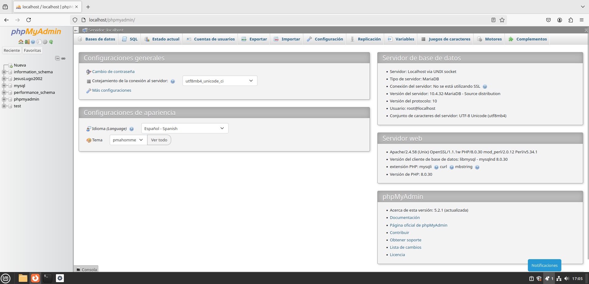
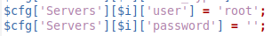
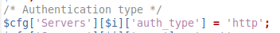
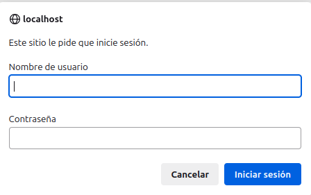
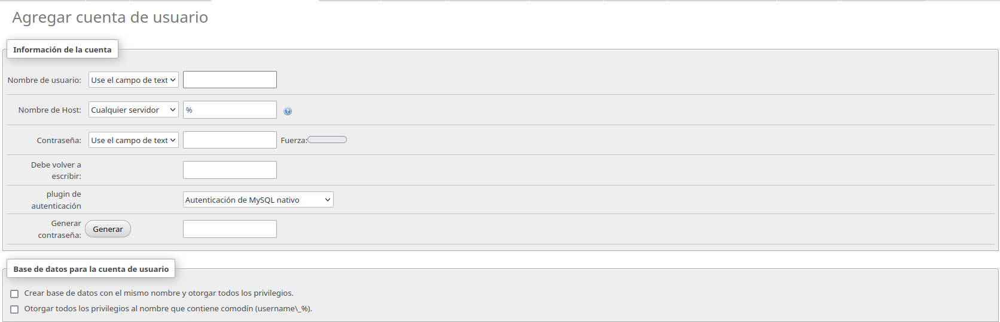
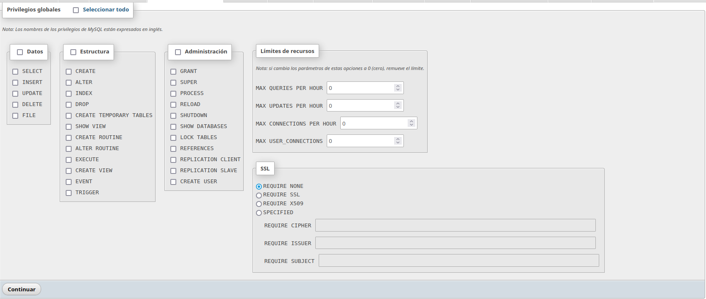

# Instalación, configuración y comprobación de XAAMP

<div align=justify>

<div align=center>
    
</div>

## Contenidos

- [Descarga e instalación](#descarga-e-instalación)
- [Configurando seguridad](#configurando-seguridad-del-servidor)
- [Añadiendo un usuario](#añadiendo-un-nuevo-usuario)

## Descarga e instalación

Primero nos vamos a la página web donde encontramos los archivos de descarga del software para distintos sistemas operativos y descargamos el deseado:

<div align=center>
    
</div>

Luego con el instalador descargado, lo ejecutamos y seleccionamos posteriormente los componentes a instalar:

<div align=center>
    
</div>

<div align=center>
    
</div>

Después de instalar el paquete de XAAMP indicado, comprobamos la instalación correcta abriendo el panel con el comando:
```
sudo /opt/lampp/manager-linux-x64.run
```
<div align=center>
    
</div>
<div align=center>
    
</div>

## Configurando seguridad del servidor

Ahora que tenemos nuestro software para abrir un servidor, toca configurarle lo básico de seguridad: crear un usuario normal separado de los privilegios de root y añadir un inicio de sesión para que el acceso requiera contraseña.

Una vez iniciado los servidores de XAAMP, nos vamos al navegador para acceder a la interfaz introduciendo en el buscador [localhost/](localhost/dashboard)

<div align=center>
    
</div>

Y luego accediendo al apartado de __PHPMyAdmin__:

<div align=center>
    
</div>

Ahora para configurar primeramente la contraseña del root, ya que no es permitido este cambio a través de la interfaz web, debemos acceder al fichero de configuración __config.inc.php__ encontrado en __/opt/lampp/phpmyadmin__. En él y en sus lineas 29 y 30, donde vemos el usuario 'root' y su 'password', cambiamos la contraseña del mismo.

<div align=center>
    
</div>

Así mismo, para pedir un nombre de usuario y una contraseña para acceder al panel de PHPMyAdmin, debemos cambiar la linea 28, cuyo valor de 'auth_type' por defecto es _config_, y modificarlo a _http_.

<div align=center>
    
</div>

Ya con este cambio, cada vez que entremos al portal de PHPMyAdmin, se nos pirá iniciar sesión con un nombre de usuario y contraseña.

<div align=center>
    
</div>

## Añadiendo un nuevo usuario

Para finalizar, entramos como usuario root y crearemos el nuevo usuario cuyos privilegios serán menores que los del root en el apartado de gestión de usuarios. Empezamos configurando el nombre y la contraseña...

<div align=center>
    
</div>

Y posteriormente los privilegios que este usuario tendrá con respecto al servidor web.

<div align=center>
    
</div>