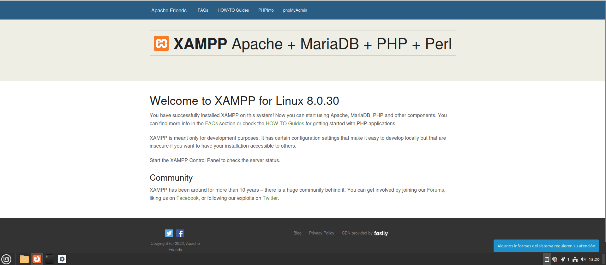

# Instalación y comprobaciones de XAAMP

<div align=justify>

## Instalación

Después de instalar el paquete de XAAMP indicado, comprobamos la instalación correcta abriendo el panel con el comando:
```
sudo /opt/lampp/manager-linux-x64.run
```
<div align=center>
    
</div>
<div align=center>
    
</div>

## Configurando seguridad del servidor

Ahora que tenemos nuestro software para abrir un servidor, toca configurarle lo básico de seguridad: crear un usuario normal separado de los privilegios de root y añadir un inicio de sesión para que el acceso requiera contraseña.

Una vez iniciado los servidores de XAAMP, nos vamos al navegador para acceder a la interfaz introduciendo en el buscador [localhost/](localhost/dashboard)

<div align=center>
    
</div>

## Comprobación