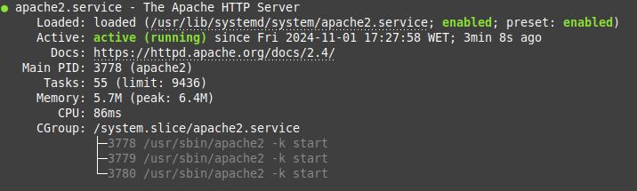
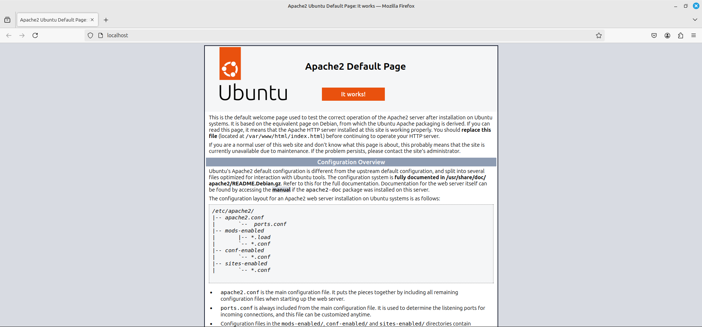
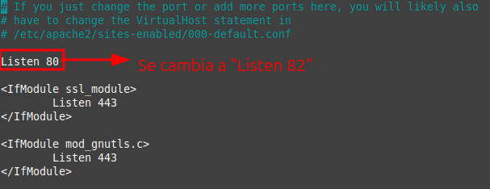
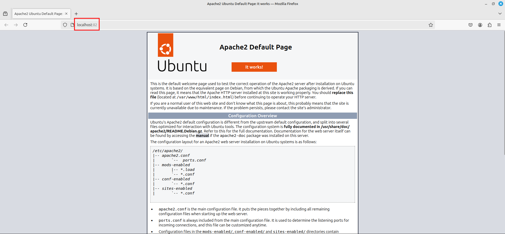
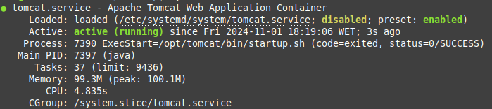

# Tarea 1.1- Instalación de servidor web Apache

<div align=center>
    
</div>

# Contenidos
- [Capas de la arquitectura web: ¿cuáles son? y funciones](#capas-de-la-arquitectura-web-cuáles-son-y-funciones)
- [Plataformas web: LAMP y WISA](#plataformas-web-lamp-y-wisa)
- [Instalación de servidor web APACHE](#instalación-de-servidor-web-apache)
  - [1. Actualizar repositorio e instalación desde la terminal](#1-actualizar-repositorio-e-instalación-desde-la-terminal)
  - [2. Comprobamos la instalación desde la terminal](#2-comprobamos-la-instalación-desde-la-terminal)
  - [3. Comprobamos la instalación desde navegador](#3-comprobamos-la-instalación-desde-navegador)
  - [4. Cambio del puerto de escucha de Apache](#4-cambio-del-puerto-de-escucha-de-apache)
- [Instalación de Tomcat](#instalación-de-tomcat)
  - [1. Instalación de Java](#1-instalación-de-java)
  - [2. Creación de usuario Tomcat](#2-creación-de-usuario-tomcat)
  - [3. Descarga y extracción del paquete Tomcat](#3-descarga-y-extracción-del-paquete-tomcat)
  - [4. Configuración del Tomcat](#4-configuración-del-tomcat)
  - [5. Comprobación de Tomcat](#5-comprobación-de-tomcat)


## Capas de la arquitectura web: ¿cuáles son? y funciones

La arquitectura en capas es un modelo de diseño de software, cuya base es la separación de las diferentes funcionalidades del sistema en capas o niveles, donde cada capa se encarga de un conjunto de tareas específicas y se comunica con los niveles adyacentes mediante interfaces bien definidas.

En una web se pueden identificar __tres capas principales__: __la capa de presentación, la capa de lógica de negocio y la capa de acceso a datos.__ La primera se encarga de mostrar la información al usuario; la segunda, de procesa la información y la tercera, de almacenar y recuperar la información.

## Plataformas web: LAMP y WISA

__LAMP__ es un sistema de infraestructura web con usa las siguientes herramientas: __Linux__ como sistema operativo; __Apache__ como servidor web; __MySQL/MariaDB__ como gestor de bases de datos y __PHP__ como lenguaje de programación.

Por otro lado, __WISA__ usa como componentes: __Windows__ (sistema operativo), __Internet Information Services__ (servidor web), __SQL Server__ (manejador de bases de datos) y __ASP__ (que hace de intermediario para trabajar con un lenguaje de programación, __Visual Basic__).

## Instalación de servidor web APACHE

Para realizar la instalación de nuestro servidor web APACHE, tenemos que realizar las siguientes acciones: 

### 1. Actualizar repositorio e instalación desde la terminal
```sh
# Actualizamos el repositorio de paquetes del sistema
sudo apt-get update

# Instalamos el paquete de Apache
sudo apt-get install apache2    
```

### 2. Comprobamos la instalación desde la terminal

Como la actividad de Apache se observa como un servicio del sistema, podemos comprobar su instalación y funcionamiento con:
```sh
systemctl status apache2
```

<div align=center>
    
</div>

### 3. Comprobamos la instalación desde navegador

Tambien podemos comprobar su funcionamiento a través del navegador, accediendo a __[localhost](http://localhost)__.

<div align=center>
    
</div>

### 4. Cambio del puerto de escucha de Apache

Por defecto, APACHE viene configurado para ajustarse en el puerto 80. Para esta actividad, cambiaremos dicha configuración para que su puerto de escucha sea el 82. Para ello, primero accederemos con privilegios de _root_ al archivo de configuración `ports.conf` con el siguiente comando:

```sh
sudo nano etc/apache2/ports.conf
```

En este fichero encontraremos toda la información y configuración relacionada con los puertos. Para cambiar el puerto de escucha, basta con reemplazar el valor de `Listen 80` a `Listen 82`.

<div align=center>
    
</div>

Y comprobamos si se realizó el cambio correctamente accediendo a __[localhost:82](http://localhost:82)__.

<div align=center>
    
</div>

> [!NOTE]
> Es posible que al intentar acceder a __localhost:82__ no funcione, esto es porque al realizar cambios en la configuración de un servicio es posible que se requiera reiniciar el mismo. En dicho caso, bastaría con ejecutar en la consola `systemctl restart apache2` para aplicar los cambios de puertos y que funcione correctamente.

## Instalación de Tomcat

A grandes rasgos, __Tomcat__ se presenta como un servidor web que implementa las tecnologías de servlets y JSP (JavaServer Pages), brindando así un entorno robusto para la ejecución de aplicaciones Java en la web. Dotado de una arquitectura flexible y escalable, Tomcat se erige como una opción privilegiada para albergar sitios web dinámicos y sofisticados.

### 1. Instalación de Java

Por ello, es un servicio que tiene como prerequisito la posisón de Java en el sistema operativo. Para suplir esta necesidad, instalaremos Java con:

```sh
sudo apt-get install openjdk-11-jdk
```

Y posteriormente comprobamos su instalación con:
```sh
java --version
```

### 2. Creación de usuario Tomcat

No es una buena práctica correr el servicio de Tomcat con privilegios de _root_, para ello, crearemos un usuario de bajo nivel para eso.

```sh
# Creamos un grupo para alojar los usuarios de tomcat
sudo groupadd tomcat

# Creamos un directorio para la ubicación de la configuración 
sudo mkdir /opt/tomcat

# Creamos un nuevo usuario con el grupo previamente creado
sudo useradd -g tomcat -d /opt/tomcat -s /usr/sbin/nologin tomcat
```

### 3. Descarga y extracción del paquete Tomcat

Descargamos la última versión del paquete Tomcat:
```sh
curl https://dlcdn.apache.org/tomcat/tomcat-9/v9.0.96/bin/apache-tomcat-9.0.96.tar.gz -o apache-tomcat-9.0.96.tar.gz
```

Y la extraemos y movemos a nuestro directorio `/opt/tomcat`:

```sh
sudo tar -zxvf apache-tomcat-*.tar.gz
sudo mv apache-tomcat-*/* /opt/tomcat/
```

Y ahora cambiamos la propiedad al usuario Tomcat para que le sea permitido escribir en los ficheros

```sh
sudo chown -R tomcat:tomcat /opt/tomcat/
```

### 4. Configuración del Tomcat

Tomcat requiere distintos pasos para iniciar con su funcionamiento. Primeramente, necesitamos saber la dirección en donde se encuentra Java instalado en nuestro sistema, para ello ejecutamos el siguiente comando que nos devuelve la ruta:

```sh
sudo update-java-alternatives -l

# OUTPUT: java-1.11.0-openjdk-amd64 1111 /usr/lib/jvm/java-1.11.0-openjdk-amd64
```

Crearemos un fichero _systemd_ para Tomcat
```sh
sudo nano /etc/systemd/system/tomcat.service
```

Y agregamos la siguiente información:
```txt
[Unit]
Description=Apache Tomcat Web Application Container
Wants=network.target
After=network.target
[Service]
Type=forking
Environment=JAVA_HOME=/usr/lib/jvm/java-1.11.0-openjdk-amd64
Environment=CATALINA_PID=/opt/tomcat/temp/tomcat.pid
Environment=CATALINA_HOME=/opt/tomcat
Environment='CATALINA_OPTS=-Xms512M -Xmx1G -Djava.net.preferIPv4Stack=true'
Environment='JAVA_OPTS=-Djava.awt.headless=true'
ExecStart=/opt/tomcat/bin/startup.sh
ExecStop=/opt/tomcat/bin/shutdown.sh
SuccessExitStatus=143
User=tomcat
Group=tomcat
UMask=0007
RestartSec=10
Restart=always
[Install]
WantedBy=multi-user.target
```

Y recargamos _systemd daemon_ :
```sh
sudo systemctl daemon-reload
```

### 5. Comprobación de Tomcat

Finalmente, podemos comprobar si se puede iniciar el servidor y su estatus con:

```sh
sudo systemctl start tomcat
systemctl status tomcat
```

<div align=center>
    
</div>