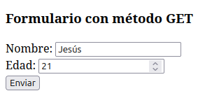
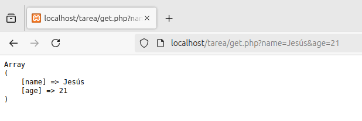
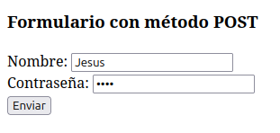
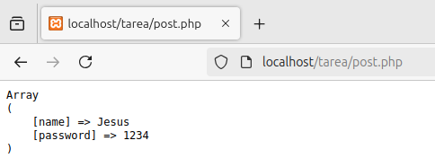

# Método de Paso de Variables de formularios. GET y POST

Esta actividad está pensada para prácticar los distintos métodos para pasar información en PHP y HTML; el método __GET__ y el método __POST__.

## Contenido
- [Diferencias entre GET y POST](#diferencias-entre-get-y-post)
    - [¿Cuándo usar GET](#cuándo-usar-get)
    - [¿Cuándo usar POST](#cuándo-usar-post)
- [Formulario en HTML](#formulario-en-html)
- [Método GET](#método-get)
- [Método POST](#método-post)

## Diferencias entre GET y POST

Ambos métodos sirven para transferir información en formatos de _arrays_ entre ficheros. Estos _arrays_ contienen parejas de clave y valor que contienen los datos como nombres y valores obtenidos de formularios rellenados por el usuario. La principal diferencia entre ambos métodos es la forma en la que se transfiere la información: __con GET transferimos los datos a través de la URL mientras que con POST lo hacemos a través del método HTTP__.

### ¿Cuándo usar GET?

La información enviada con GET es __visible para todos__ a través de la URL, además de que la cantidad de información es limitada a 2000 caracteres. Sin embargo, al aparecer la información en URL, esta puede ser _guardada_ como _bookmark_ y puede resultar útil en muchos casos como en la optimización del SEO. El método GET __NUNCA debería ser usado para información confidencial__ como contraseñas.

### ¿Cuándo usar POST?

La información enviada con POST es __invisible para todos__ y no tiene límites en cuanto a la cantidad de datos; además el método POST a menudo ofrece funcionalidades avanzadas relacionadas con la subida de ficheros externos. Sin embargo, la información como variables no son mostradas en el URL por lo que no pueden ser guardadas como _bookmark_. Este método es el más recomendado para crear formularios por su seguridad.

## Formulario en HTML

En el [fichero HTML](./index.php), se han creado dos formularios, uno utilizando el método GET y otro el método POST, para posteriormente comparar y mostrar las diferencias que existen entre ambos y su propio funcionamiento.

```html
<!DOCTYPE html>
<html lang="en">
<head>
    <meta charset="UTF-8">
    <meta name="viewport" content="width=device-width, initial-scale=1.0">
    <title>GET and POST</title>
</head>
<body>
    <h3>Formulario con método GET</h3>
    <form action="get.php" method="GET">
        Nombre: <input type="text" name="name"><br>
        Edad: <input type="number" name="age"><br>
        <input type="submit" value="Enviar">
    </form>

    <h3>Formulario con método POST</h3>
    <form action="post.php" method="POST">
        Nombre: <input type="text" name="name"><br>
        Contraseña: <input type="password" name="password"><br>
        <input type="submit" value="Enviar">
    </form>
</body>
</html>
```

## Método GET

Creamos nuestro fichero [get.php](./get.php) que contiene la estructura para recibir y mostrar la información obtenida del formulario.

```php
<?php
    echo "<pre>";
    print_r($_GET);
?>
```

Enviamos los datos a través de nuestro formulario GET.

<div align=center>
        
</div>

Podemos ver cómo se nos abre una página con el resultado. __Debemos destacar que la información es visible en la URL__:

<div align=center>
        
</div>

## Método POST

Creamos nuestro fichero [post.php](./post.php) que contiene la estructura para recibir y mostrar la información obtenida del formulario.

```php
<?php
    echo "<pre>";
    print_r($_POST);
?>
```

Enviamos los datos a través de nuestro formulario GET.

<div align=center>
        
</div>

Podemos ver cómo se nos abre una página con el resultado. En este caso, la información __no es visible en la URL__, lo que la hace indicada para __enviar información confidencial__.

<div align=center>
        
</div>