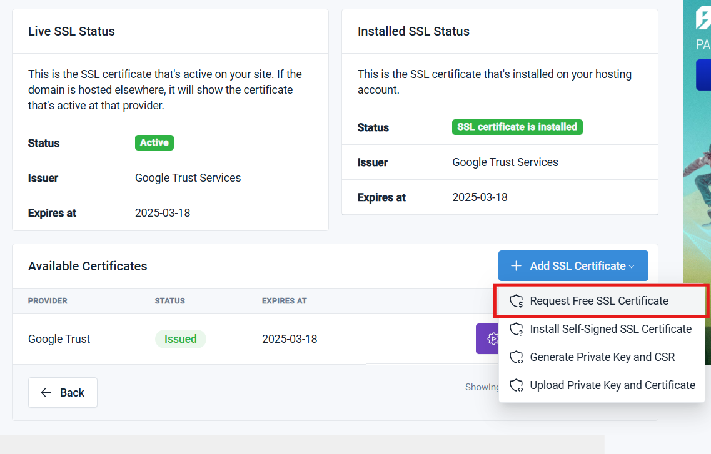

# SSL en InfinityFree

    

# Contenidos

- [Introducción](#introducción)
- [Generación de certificado SSL gratuito](#generación-de-certificado-ssl-gratuito)

## Introducción

Para esta práctica debemos tomar en cuenta la creación previa de una cuenta en el servicio de _hosting_ gratuito de InfinityFree así como también de algún sitio web/dominio que necesite de la certificación SSL que procederemos a crear en unos momentos.

## Generación de certificado SSL gratuito

Primeramente accederemos a nuestra cuenta y posteriormente al sitio web que tenemos creado a través del panel de control.

    

Luego, en el panel de navegación de la izquierda, accedemos al apartado de __SSL Certificates__ y en el menú que se nos muestra, a la opción de __Add SSL Certificate__, donde cogeremos la primera opción: __Request Free SSL Certificate__.

    

Luego dejamos que seleccione automaticamente el proveedor del certificado y creamos la orden de solicitud.

    

Y finalmente, podemos ver la información de nuestro certificado SSL así como también la opción (que se recomienda utilizar) para automatizar la instalación en nuestro sitio web. También se puede destacar la posibilidad de ver la información más confidencial de nuestro certificado como la clave privada.

    

