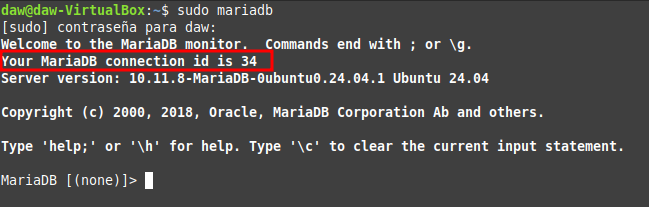
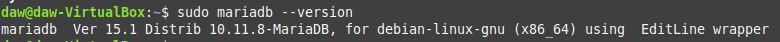
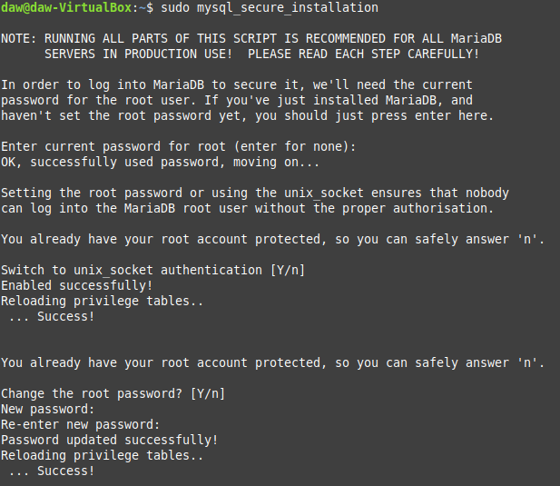
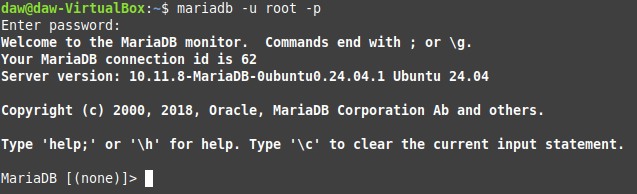
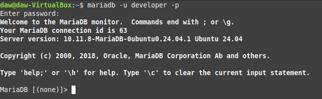
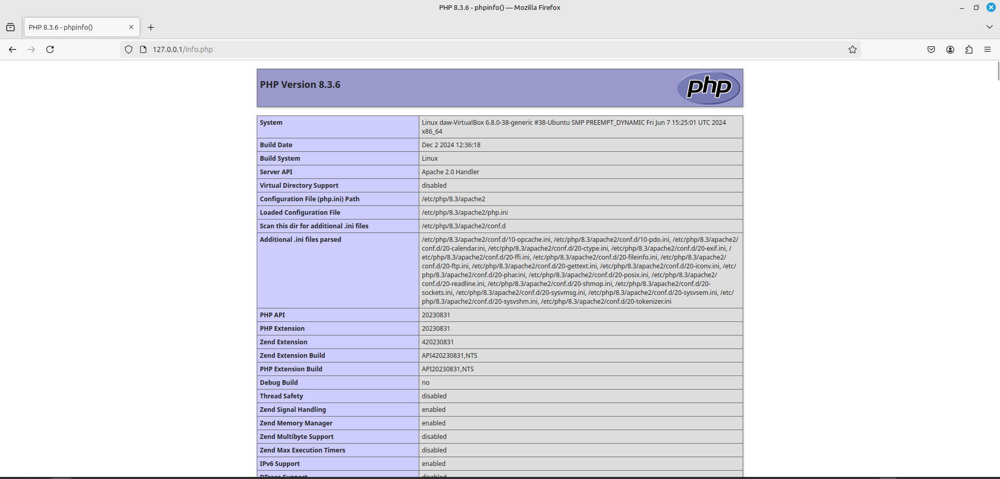
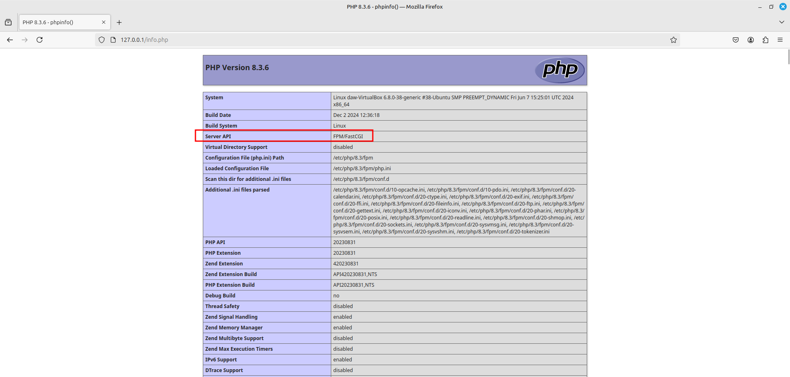

# LAMP: Instalación y configuración

<div align=center>
    
</div>

<div align=justify>

# Contenidos

- [¿Qué es LAMP?](#qué-es-lamp)
- [Sistema operativo](#sistema-operativo)
- [Servidor web](#servidor-web)
- [El gestor de bases de datos](#el-gestor-de-bases-de-datos)
- [Lenguaje de programación](#lenguaje-de-programación)


## ¿Qué es LAMP?

El acrónimo **LAMP** está compuesto por las iniciales de sus cuatro componentes: **L**inux, **A**pache, **M**ySQL y **P**HP. Estos forman la infraestructura en el servidor, que hace posible la creación y el alojamiento de páginas web dinámicas.

Un servidor LAMP es la opción preferida por muchos por sus bajo coste y su alta disponibilidad. Además, sus componentes individuales pueden ser reemplazados fácilmente por aquellos con las mismas funciones.

## Sistema operativo

Muchas distribuciones de Linux están disponibles de forma gratuita como software de código abierto, incluso Ubuntu. Es muy importante mantener el repositorio de paquetes actualizado. Para ello, ejecutamos:

```sh
sudo apt-get update
sudo apt-get upgrade
```

## Servidor web

En caso de que durante la instalación de Ubuntu, Apache no haya sido establecido como servidor web, es posible hacerlo en cualquier momento usando el siguiente comando:

```sh
sudo apt-get install apache2
```

## El gestor de bases de datos

MariaDB es un sistema de gestión de bases de datos relacionales (RDBMS) gratuito y de código abierto. Después de que se instale con el siguiente comando, el servidor MariaDB debe ejecutarse automáticamente.

```sh
sudo apt install mariadb-server mariadb-client
```

Para comprobar que está en funcionamiento, podemos utilizar el comando `sudo mariadb` para abrir y comprobar el estado de servidor.

<div align=center>
    
</div>

Para permitir que MariaDB se inicie automáticamente en el momento del arranque, debemos ejecutar:

```sh
sudo systemctl enable mariadb
```

Y para visualizar su versión:

```sh
mariadb --version
```

<div align=center>
    
</div>

Ejecutamos un script de seguridad posterior a la instalación, por medio del siguiente comando:
```sh
sudo mysql_secure_installation
```

Cuando nos solicite que escribamos la contraseña root de MariaDB, pulsa Intro ya que la contraseña root aún no está configurada. Después escribe tu contraseña de root para el servidor MariaDB.

A continuación podemos pulsar Intro para responder todas las preguntas restantes. Esto eliminará el usuario anónimo, deshabilitará el inicio de sesión raíz remoto y eliminará la base de datos de prueba.

<div align=center>
    
</div>

Por defecto, MariaDB utiliza `unix_socket` como sistema de autenticación. Esto trabaja, principalmente de la siguiente forma: cuando un usuario intenta conectarse a MariaDB, el servidor verifica si el usuario del sistema operativo que está intentando conectarse coincide con un usuario de la base de datos. Si el nombre de usuario del sistema coincide con un usuario de la base de datos, se le permite el acceso sin necesidad de proporcionar una contraseña.

Esto se debe al uso de _sockets Unix_, que son una forma de comunicación entre procesos en sistemas operativos tipo *Unix* (como *Linux*). Cuando un cliente se conecta a MariaDB a través de un *socket Unix*, el servidor puede verificar la identidad del usuario del sistema operativo.

Para iniciar sesión con la contraseña nueva, podemos ejecutar el siguiente comando:

```sh
mariadb -u root -p
```

<div align=center>
    
</div>

Con motivos de la práctica, crearemos un usuario **developer** cuya contraseña será **5t6y7u8i**. Para ello, después de haber iniciado sesión como root, ejecutamos la siguiente sentencia SQL.

```sql
CREATE USER 'developer'@'%' IDENTIFIED BY '5t6y7u8i';
```

Y ya con el usuario creado, iniciamos sesión con el siguiente comando y luego añadimos la respectiva contraseña:

```sh
mariadb -u developer -p
```

<div align=center>
    
</div>

## Lenguaje de programación

El último paso en la configuración del LAMP stack es la instalación del lenguaje de programación – en este caso PHP, así como la de la librería PEAR que viene incluida en el paquete (PHP Extension and Application Repository), que incluye útiles extensiones y módulos para PHP. La instalación se inicia con el comando:

```sh
sudo apt-get install php 
```

Y posteriormente, habilitamos el módulo de PHP y reiniciaremos Apache:

```sh
sudo a2enmod php
sudo systemctl restart apache2
```

Podemos verificar la versión de PHP instalada con:

```sh
php --version
```

Ahora para realizar pruebas, crearemos un fichero `info.php` en el directorio raíz con:
```sh
sudo nano /var/www/html/info.php
```
Y su contenido será `<?php phpinfo(); ?>`.

Podemos acceder ahora al contenido de este fichero entrando a nuestro navegador y yendo a la url [127.0.0.1/info.php](127.0.0.1/info.php).

<div align=center>
    
</div>

Ahora ejecutaremos algo de código en PHP. Muchas veces será necesario el uso de PHP-FPM. Para instalarlo, primeramente debemos deshabilitar PHP de Apache con:

```sh
sudo a2dismod php
```

Posteriormente instalamos con:

```sh
sudo apt install php-fpm
```

Continuamos habilitando `proxy_fcgi` y el módulo `setenvif`:

```sh
sudo a2enmod proxy_fcgi setenvif
```

El siguiente paso será habilitar el fichero de configuración con:

```sh
sudo a2enconf php-fpm
```

Y finalmente reiniciar el servicio:

```sh
sudo systemctl restart apache2
```

<div align=center>
    
</div>

</div>

> [!NOTE]
> Podemos comprobar como ha cambiado porque en el apartado `Server API` antes decía **Apache 2.0 Handler** a **FPM/FastCGI**.