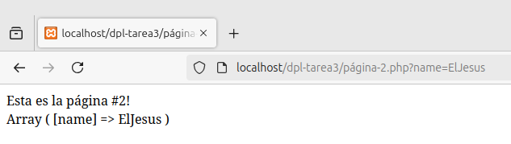

# Redirecciones en PHP

<div align=justify>

<div align=center>
    
</div>

## Contenido

- [¿Qué son las redirecciones?](#qué-son-las-redirecciones)
- [Práctica guiada](#práctica-guiada)
    - [Paso 1](#1-creación-del-fichero-redireccionesphp-y-página-2php)
    - [Paso 2](#2-redirección-a-página-3php)
    - [Paso 3](#3-parámetros-en-el-redireccionamiento)

## ¿Qué son las redirecciones?

Las redirecciones PHP son instrucciones escritas en este lenguaje que permiten redirigir a los usuarios y motores de búsqueda de una URL a otra. A diferencia de las redirecciones HTML (que se ejecutan en el lado del cliente), las redirecciones PHP se realizan en el lado del servidor. Esto las hace más rápidas y seguras.

## Práctica guiada

Para esta práctica, utilizaremos el servidor web proporcionado por XAMPP, introduciendo los ficheros necesarios para trabajar en el directorio `opt/lampp/htdocs`.

### 1. Creación del fichero "redirecciones.php" y "página-2.php"

Creamos el fichero [redirecciones.php](./files/redirecciones.php) conteniendo la estructura básica de un HTML con una redirección a un fichero [página-2.php](./files/página-2.php).

```html
<!DOCTYPE html>
<html lang="en">
<head>
    <meta charset="UTF-8">
    <meta name="viewport" content="width=device-width, initial-scale=1.0">
    <title>Redirecciones</title>
</head>
<body>
    <a href="./página-2.php">Haz click aquí para redireccionar!</a>
</body>
</html>
```

El contenido de __página-2.php__ es un mensaje autodescriptivo sencillo.

```php
<?php
echo "Esta es la página #2!";
?>
```

Ahora si intentamos probar, vemos que al acceder a _redirecciones.php_, podemos ver el enlace.

<div align=center>
    
</div>

Y que al darle click, nos dirige a _página-2.php_.

<div align=center>
    
</div>

### 2. Redirección a "página-3.php"

Ahora para poner a prueba las redirecciones por PHP, modificamos _página-2.php_ para añadir la nueva linea _header_.

```php
<?php
echo "Esta es la página #2!";

header("location: página-3.php");
?>
```

Y ahora creamos el nuevo fichero [página-3.php](./files/página-3.php) con el siguiente contenido para demostrar que estamos en dicha página:

```php
<?php
echo "Esta es la página #3!";
?>
```

Ahora al acceder al enlace de _redirecciones.php_, en vez de terminar en _página-2.php_, vemos como terminamos en _página-3.php_:

<div align=center>
    
</div>

### 3. Parámetros en el redireccionamiento

Ahora pondremos a prueba la redirección de información. Pasaremos un parámetro `name=ElJesus` a través del enlace de _redirecciones.php_.

```html
<!DOCTYPE html>
<html lang="en">
<head>
    <meta charset="UTF-8">
    <meta name="viewport" content="width=device-width, initial-scale=1.0">
    <title>Redirecciones</title>
</head>
<body>
    <a href="./página-2.php?name=ElJesus">Haz click aquí para redireccionar!</a>
</body>
</html>
```

Y ahora editaremos rápidamente el fichero _página-2.php_ para mostrar esta información y evitar la redirección a _página-3.php_:

```php
<?php
echo "Esta es la página #2!";
echo "<br>";
print_r($_GET);
// header("location: página-3.php");
?>
```

Al acceder al enlace de redirección, vemos ahora como cambia la página #2 añadiendo la información obtenida a través de los parámetros.

<div align=center>
    
</div>

Y ahora modificaremos la linea de _header_ para redireccionar esta información a la _página-3.php_ desde el código del propio servidor.

```php
<?php
echo "Esta es la página #2!";

header("location: página-3.php?name=" . $_GET['name']);
?>
```

Y cambiaremos un poco el código de _página-3.php_ para mostrar este dato.

```php
<?php
echo "Esta es la página #3! <br>";

print_r($_GET);
?>
```

Ya con todos los cambios realizados, podemos confirmar finalmente que al acceder al enlace de _redirecciones.php_, esta nos lleva directamente a la _página-3.php_ que muestra la información enviada a través del método GET de HTTP.

<div align=center>
    
</div>


</div>