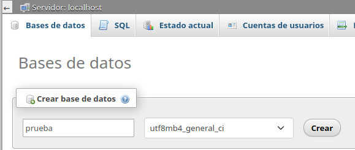
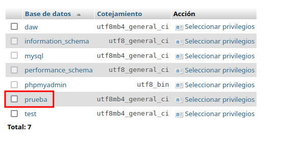
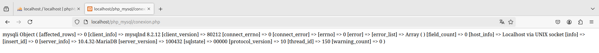
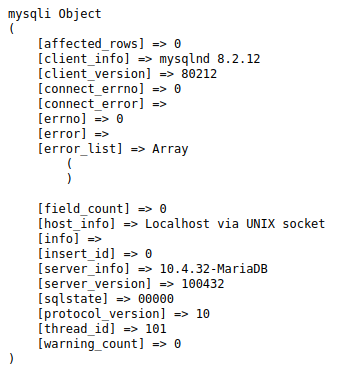
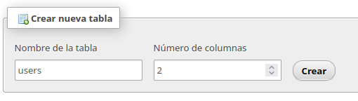
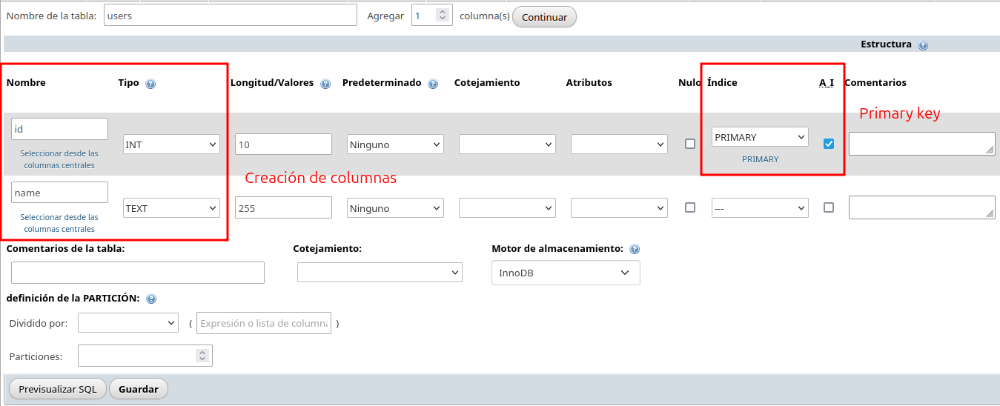

# Creación de bases de datos, tablas y conexión

<div align=center>
    
</div>

<div align=justify>

## Contenidos

- [Creación de la base de datos](#creación-de-la-base-de-datos)
- [Conexión a la base de datos por PHP](#conexión-a-la-base-de-datos-por-php)
- [Creación de tablas](#creación-de-tablas-en-la-base-de-datos)

## Creación de la base de datos
Para esta práctica guiada, primero crearemos en nuestro servidor una base de datos __prueba__ para la realización del resto de las actividades. Para ello, nos iremos a __PHPMyAdmin__ y en el apartado _bases de datos_ crearemos nuestra base de datos con nombre _prueba_.

<div align=center>
    
</div>

Después de añadirla, la veremos en el listado.

<div align=center>
    
</div>

## Conexión a la base de datos por PHP
Lo siguiente será efectuar una conexión a la base de datos creada, para ello en `opt/lampp/htdocs` crearemos una carpeta `php_mysql` (para almacenar nuestros ficheros de la actividad) y crearemos un fichero `conexion.php` que incluirá el siguiente código:

```php
<?php
$conn = mysqli_connect('localhost', 'daw', 'daw', 'prueba');
print_r($conn);
```

Con la función `mysqli_connect()` crearemos una conexión pasándole como argumentos el nombre de host, el usuario, la contraseña y el nombre de la base de datos. Dicha conexión la almacenaremos en una variable `$conn` para después mostrarla en la siguiente linea con el `print_r($conn);`. Este _print_ nos permite comprobar si hemos hecho la conexión.

<div align=center>
    
</div>

Para mejorar la forma en la que se nos muestra la información de la bases de datos, modificamos nuestra `conexion.php` añadiendo un `echo "<pre>;` antes del `print_r($conn);` y quedaría de esta forma.


<div align=center>
    
</div>

## Creación de tablas en la base de datos
Ahora continuaremos creando una simple tabla __user__ con dos columnas, __id__ y __name__. Para ello nos iremos a __PHPMyAdmin__, a nuestro apartado de bases de datos y accederemos a _prueba_.
Primero, introduciremos el __nombre de nuestra tabla__ con el __número de columnas__.

<div align=center>
    
</div>

Ahora en la interfaz especificamos los tipos de las columnas (__INT__ y __TEXT__) y a la columna _id_ le asignamos el índice primario y marcamos el _checkbox_ de A-I (_AutoIncremental_).

<div align=center>
    
</div>

</div>