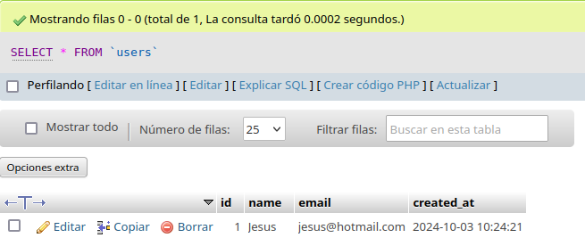

# Insertar, leer y eliminar registros de la base de datos

<div align=center>
    
</div>

<div align=justify>

## Contenidos

- [Modificación de la tabla 'users'](#modificación-de-la-tabla-users)
- [Insertar registros con PHP](#insertar-registros-con-php)
- [Leer registros con PHP](#leer-registros-con-php)
- [Eliminar y actualizar registros con PHP](#eliminar-y-actualizar-registros-con-php)

## Modificación de la tabla 'users'
Para la realización de esta actividad, he modificado la tabla _users_ creada anteriormente añadiéndole los campos de _email_ y *created_at*.

<div align=center>
    
</div>

## Insertar registros con PHP
Ahora añadiremos nuestro primer usuario, para ello modificaremos nuestra [conexion.php](./conexion.php) de la siguiente forma:

1. Crearemos nuestra sentencia SQL para insertar datos y lo almacenamos en una variable:
```php
$insert = "insert into users(name, email) values('Jesus', 'jesus@hotmail.com')";
```

2. Ahora aplicaremos la sentencia almacenada en nuestra base de datos usando la función `mysqli_query`, pasando como argumentos la conexión y la sentencia:
```php
$return = mysqli_query($conn, $insert);
```

3. Por último, como buena práctica, cerraremos la conexión con la base de datos:
```php
mysqli_close($conn);
```

Accedemos a nuestra __conexion.php__ por el servidor y, al comprobar la base de datos, nos daremos cuenta de nuestro registro insertado.
<div align=center>
    
</div>

Luego de esto, he añadido un par de registros más para la continuidad de esta práctica.

## Leer registros con PHP
De forma similar a como insertamos los registros, crearemos un fichero [leer.php](./leer.php) que contendrá la conexión con la base de datos de forma similar pero, con una sentencia SQL de _select_; crearemos nuestra sentencia en una variable `$sql` y la efectuaremos con la función `mysqli_query($conn, $sql);` almacenando su resultado en `$result`.

```php
<?php
echo "<pre>";

$conn = mysqli_connect('localhost', 'daw', 'daw', 'prueba');

$sql = 'select id, name, email, created_at from users';
$result = mysqli_query($conn, $sql);
```

A continuación veremos las distintas salidas que nos otorga esta variable `$result` y las formas de visualizar la lectura de registros.

1. Si hacemos un `print_r($result)`, nos dará un __mysqli_result Object__:

<div align=center>  
    
</div>

2. Si usamos una función `mysqli_fetch_all($result)` de la siguiente forma:
```php
$rows = mysqli_fetch_all($result);
```
y hacemos un `print_r($rows)`, se nos dará un _array_ que contendrá otro _array_ por cada registro de la tabla:

<div align=center>  
    
</div>

3. Podemos usar la función `mysqli_fetch_array($result, MYSQLI_NUM)`, pero para mostrar los registros hará falta crear un bucle y recorrerlos. Para ello, nos vamos a nuestro __leer.php__ y modificamos de la siguiente forma:

```php
$result = mysqli_query($conn, $sql);
$rows = mysqli_fetch_array($result, MYSQLI_NUM);

do {
    $data[] = $rows;
} while ($rows = mysqli_fetch_array($result, MYSQLI_NUM));

echo "<pre>";
print_r($data);
```

Y podemos comprobar ahora como se nos muestra el resultado de forma similar a la anterior:

<div align=center>  
    
</div>

Cabe destacar que el argumento __MYSQLI_NUM__ es lo que da, como _claves_ de los resultados, valores númericos. En cambio, podemos cambiarlo a __MYSQLI_ASSOC__ para que nos dé como claves los nombres de los campos:

<div align=center>  
    
</div>

También es posible utilizar la constante __MYSQLI_BOTH__ para que se nos dé los campos de ambas formas (valores númericos y nombres de campo).

## Eliminar y actualizar registros con PHP
La dinámica se mantiene con respecto a los anteriores ejercicios; crearemos un fichero [update.php](./update.php) que contendrá nuestra operación de actualización, que en nuestro caso, será cambiar el nombre del primer registro.

<div align=center>  
    
</div>

Como vemos, el nombre es "Jesús", pero este se cambiará a "Susan" con el siguiente código PHP:
```php
$sql = 'UPDATE users SET name = "Susan" WHERE id = 1';
$result = mysqli_query($conn, $sql);
```
Al ejecutarlo abriendo _update.php_, vemos como este cambio se ha efectuado sobre la base de datos.

<div align=center>  
    
</div>

Ahora eliminaremos el primer registro de nuestra base de datos, para ello, solo nos hará falta cambiar nuestra sentencia SQL:
```php
// $sql = 'UPDATE users SET name = "Susan" WHERE id = 1';
$sql = 'DELETE FROM users WHERE id = 1';
```
Ahora tras ejecutarlo, podemos ver como se ha eliminado correctamente de nuestra base de datos.

<div align=center>  
    
</div>

</div>