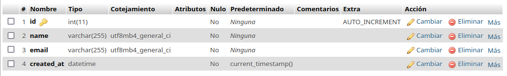
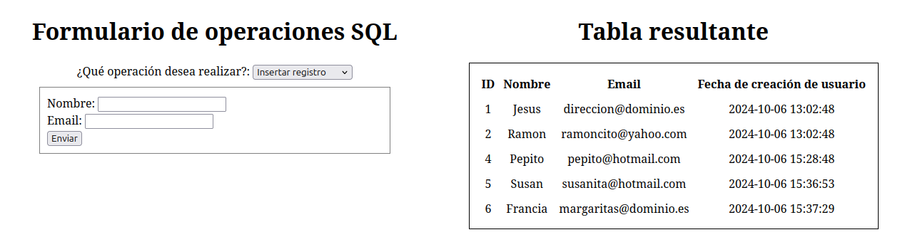

# Interfaces de operaciones SQL

<div align=justify>

## Contenidos
- [Base de datos](#base-de-datos)
- [Estructura y funcionamiento](#estructura-y-funcionamiento)
    - [index.php](#indexphp)
    - [sql_get.php](#sql_getphp)
    - [sql_post.php](#sql_postphp)
    - [scripts.js](#scriptsjs)

## Base de datos

Para esta actividad, se ha creado una base de datos __"tarea6"__ en _PHPMyAdmin_, que contiene una tabla _users_ con los campos ID, _name_, _email_ y *created_at*.

<div align=center>
    
</div>

## Estructura y funcionamiento

De forma resumida podría explicar el funcionamiento de la aplicación de la siguiente forma: al abrir la página web, un script de JavaScript se ejecuta para realizar una consulta SQL, por medio de un _HTTP Request_ a *sql_get.php* e imprimir los datos obtenidos en una tabla. Esta función es ejecutada al iniciar la página, por lo cual, tras actualizar la misma después de realizar alguna operación, se mostrarán siempre los datos actualizados en esa tabla.

Cuando elegimos una operación SQL a ejecutar en el apartado "¿qué operación desea realizar?", el código JavaScript limpiará y mostrará un formulario distinto por cada tipo de operación que hay al momento.

<div align=center>
    
</div>

Al rellenar los datos del formulario y enviarlos, se ejecutará el fichero *sql_post.php* que se encargará de aplicar la secuencia SQL correspondiente con los datos otorgados y, tras realizarlo, recargar a la página anterior, mostrando así los cambios realizados en la tabla resultante.

La "aplicación" creada contiene los siguientes ficheros:

### [index.php](./index.php) 

El fichero principal que contiene la estructura del formulario dinámico y la tabla resultante.

```html
<!DOCTYPE html>
<html lang="en">
<head>
    <meta charset="UTF-8">
    <meta name="viewport" content="width=device-width, initial-scale=1.0">
    <title>SQL Form</title>
    <link rel="stylesheet" href="css/style.css">
</head>
<body>
    <main>
        <div>
            <h1 id="form-title">Formulario de operaciones SQL</h1>
            <label for="sql-query-type">¿Qué operación desea realizar?:</label>
            <select name="sql-query-type" id="sql-query-type">
                <option value="insert">Insertar registro</option>
                <option value="update">Actualizar registro</option>
                <option value="delete">Remover registro</option>
            </select>
            <div id="form-container">
                <form action="sql_post.php" method="post" id="insert-form">
                    <input type="hidden" name="insert">
                    <label for="name">Nombre: </label><input type="text" name="name" value="" required><br>
                    <label for="email">Email: </label><input type="email" name="email" value="" required><br>
                    <input type="submit" value="Enviar">
                </form>
                <form action="sql_post.php" method="post" id="update-form">
                    <input type="hidden" name="update">
                    <label for="uid">ID del registro: </label><input type="number" name="uid" min="0" value="" required><br>
                    <label for="name">Nombre: </label><input type="text" name="name" value=""><br>
                    <label for="email">Email: </label><input type="email" name="email" value=""><br>
                    <input type="submit" value="Enviar">
                </form>
                <form action="sql_post.php" method="post" id="delete-form">
                    <input type="hidden" name="delete">
                    <label for="uid">ID del registro: </label><input type="number" name="uid" min="0" value="" required><br>
                    <input type="submit" value="Enviar">
                </form>
            </div>
        </div>
        <div id="table-container">
            <h1>Tabla resultante</h1>
            <table id="result-table">
                <tr>
                    <th>ID</th>
                    <th>Nombre</th>
                    <th>Email</th>
                    <th>Fecha de creación de usuario</th>
                </tr>
            </table>
        </div>
    </main>
   <script type="module" src="js/scripts.js" type="text/javascript"></script>
</body>
</html>
```

### [sql_get.php](./sql_get.php) 

Script en PHP que obtiene los datos de la base de datos por medio de una consulta SQL.

```php
<?php

$conn = mysqli_connect('localhost', 'daw', 'daw', 'tarea6');

$query = "select * from users";
$result = mysqli_query($conn, $query);
$rows = mysqli_fetch_all($result, MYSQLI_ASSOC);
print json_encode($rows);

mysqli_close($conn);
```

### [sql_post.php](./sql_post.php) 

Controlador PHP que gestiona las entradas del formulario y ejecuta distintas secuencias SQL dependiendo de la opción elegida.

```php
<?php

$conn = mysqli_connect("localhost", "daw", "daw", "tarea6");

$queryType = key($_POST);
$query = "";

switch ($queryType) {
    case "insert":
        $name = mysqli_real_escape_string($conn, $_POST["name"]);
        $email = mysqli_real_escape_string($conn, $_POST["email"]);
        $query = "INSERT INTO users(name, email) VALUES('$name', '$email')";
        break;
    case "update":
        $name = mysqli_real_escape_string($conn, $_POST["name"]);
        $email = mysqli_real_escape_string($conn, $_POST["email"]);
        $id = mysqli_real_escape_string($conn, $_POST["uid"]);
        $query = "UPDATE users SET name = '$name', email = '$email' WHERE id = $id";
        break;
    case "delete":
        $id = mysqli_real_escape_string($conn, $_POST["uid"]);
        $query = "DELETE FROM users WHERE id = $id";
        break;
    default:
        die("Invalid query type");
}

$result = mysqli_query($conn, $query);
mysqli_close($conn);

header("refresh: 3; url=index.php");
echo "Actualizando datos...";
```

### [scripts.js](./js/scripts.js)

Fichero de JavaScript que gestiona distintos aspectos importantes de la aplicación, como la consulta SQL inicial tras cargar la página web, la impresión de los datos obtenidos en una tabla y la creación de un formulario dinámica en base a las opciones elegidas de acciones posibles.

```js
// Inicialización y consulta de la tabla
const selectResult = await fetchData();

async function fetchData() {
    const response = await fetch("sql_get.php");
    const data = await response.json();
    return data
}

for (let userData of selectResult) {
    createRow(userData);
}

function createRow(data) {
    document.getElementById("result-table").innerHTML += `
    <tr>
        <td>${data.id}</td>
        <td>${data.name}</td>
        <td>${data.email}</td>
        <td>${data.created_at}</td>
    </tr>
    `;
}

// Cambio de operaciones SQL
const sqlQueryTypeSelector = document.getElementById("sql-query-type")
sqlQueryTypeSelector.addEventListener('change', () => {
    let queryType = sqlQueryTypeSelector.value
    changeForm(queryType);
})

function changeForm(queryType) {
    switch (queryType) {
        case "insert":
            setInsertForm();
            break;
        case "update":
            setUpdateForm();
            break;
        case "delete":
            setDeleteForm();
            break;
    }
} 

let insertForm = document.getElementById("insert-form");
let updateForm = document.getElementById("update-form");
let deleteForm = document.getElementById("delete-form");

// Operación SQL: Insert
function setInsertForm() {
    insertForm.style.display = "block";
    updateForm.style.display = "none";
    deleteForm.style.display = "none";
}

// Operación SQL: Update
function setUpdateForm() {
    insertForm.style.display = "none";
    updateForm.style.display = "block";
    deleteForm.style.display = "none";
}

// Operación SQL: Delete
function setDeleteForm() {
    insertForm.style.display = "none";
    updateForm.style.display = "none";
    deleteForm.style.display = "block";
}
```

</div>