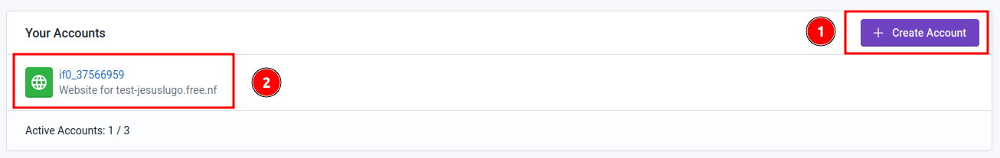
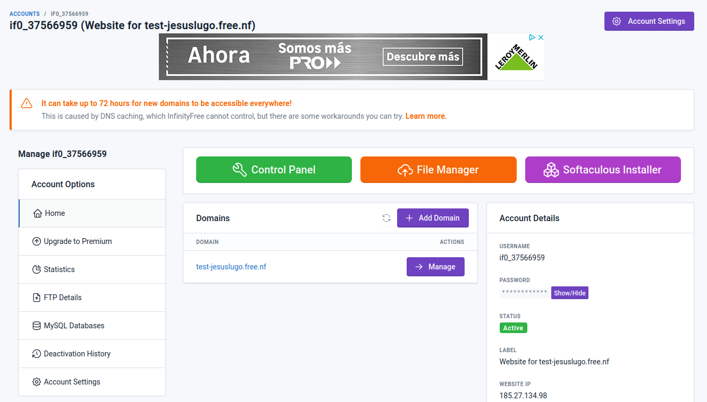
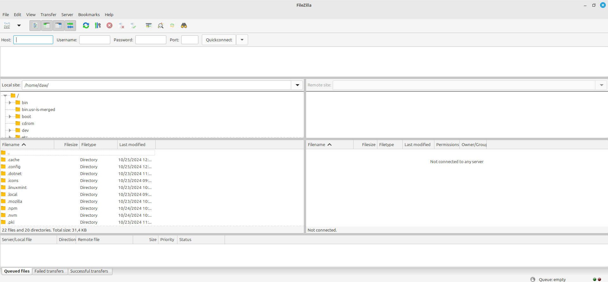
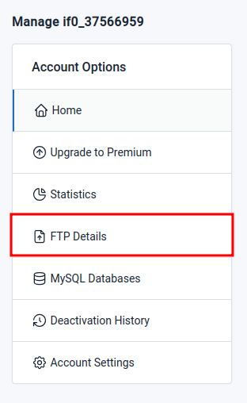
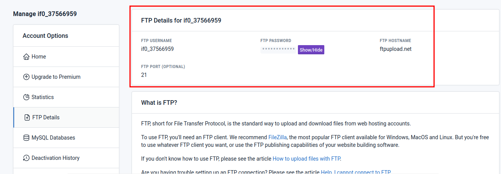
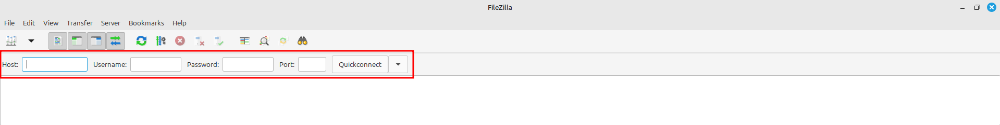
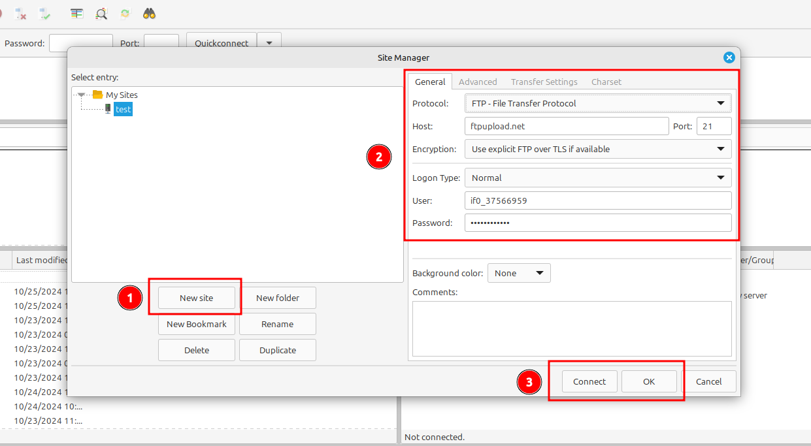
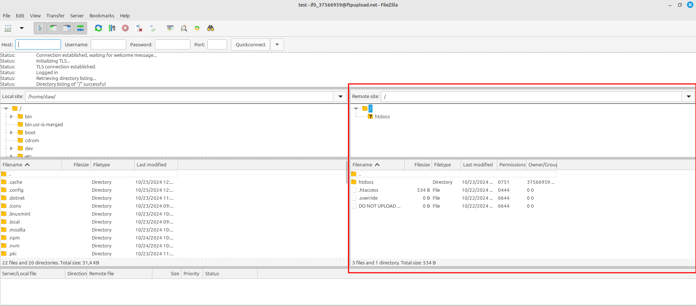
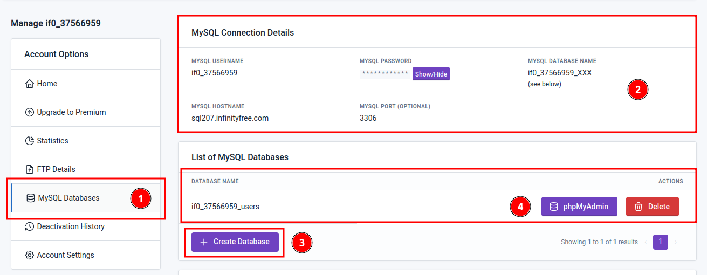
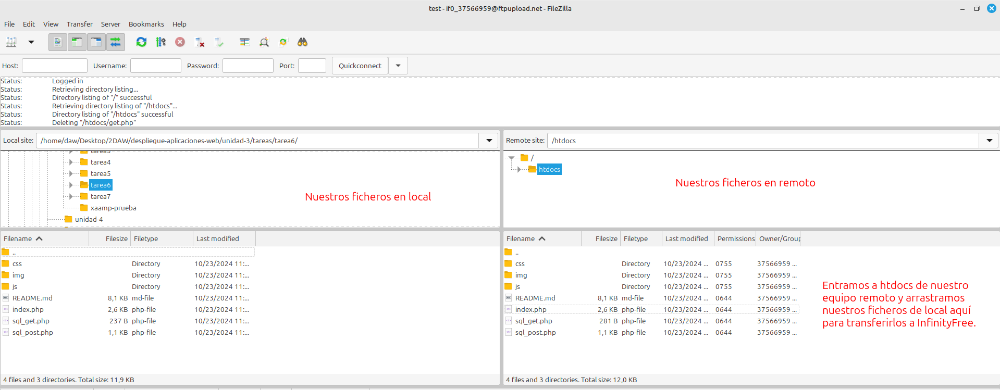

<div align=justify>

# Tarea 07 - Migración de XAMPP a InfinityFree + Filezilla

<div align=center>  
    
</div>

## Contenido


- [Tarea 07 - Migración de XAMPP a InfinityFree + Filezilla](#tarea-07---migración-de-xampp-a-infinityfree--filezilla)
  - [Contenido](#contenido)
  - [Creación de cuenta en InfinityFree](#creación-de-cuenta-en-infinityfree)
  - [Panel de control](#panel-de-control)
  - [Instalación de FileZilla](#instalación-de-filezilla)
  - [Vinculación de InfinityFree con FileZilla](#vinculación-de-infinityfree-con-filezilla)
  - [MySQL Database](#mysql-database)
  - [Adaptación de ficheros](#adaptación-de-ficheros)
  - [Migración de ficheros](#migración-de-ficheros)


## Creación de cuenta en InfinityFree

Se inicia con la creación de la cuenta de _hosting_ que utilizaremos para alojar nuestra página web creada previamente en XAMPP. Para ello seguimos los siguientes pasos:

1. Creamos nuestra cuenta de _hosting_ en el botón _Create Account_, procederemos con eso a rellenar los datos solicitados en relación al sitio web, como el dominio, opciones de seguridad...
2. Después de creada podemos ingresar en la lista de abajo.

<div align=center>  
    
</div>

## Panel de control 

<div align=center>  
    
</div>

En este panel de control podemos ver información importante como aquella relacionada con la cuenta de _hosting_, el estado de la misma, la IP del sitio web y distintas opciones que nos permitirá modificar, consultar y crear aspectos y apartados de nuestra cuenta y sitio web. Las que usaremos principalmente para la migración son __FTP Details__ y __MySQL Databases__.

## Instalación de FileZilla

Para gestionar los ficheros de nuestro sitio web, debemos utilizar un software de trasferencia de archivos (FTP). En nuestro caso, y como nos recomiendo el mismo _InfinityFree_, utizaremos __FileZilla__.

Para instalarla, basta con ir a la terminal de comandos y utilizar:
```sh
apt install filezilla
```

Después de estar instalada podemos acceder con:
```sh
filezilla
```

Y esto nos abrirá su panel de control.

<div align=center>  
    
</div>

## Vinculación de InfinityFree con FileZilla

Para vincular el directorio de nuestro sitio web con el gestor de FileZilla, debemos acceder a __FTP Details__.

<div align=center>  
    
</div>

Dentro nos encontraremos con nuestros datos sobre el FTP.

<div align=center>  
    
</div>

Ya con esta información, accederemos al apartado superior de FileZilla e ingresaremos los datos solicitados para realizar la conexión (también podemos añadirla en el gestor de sitios de la aplicación para tener creada una referencia o acceso rápido a la misma y no tener que repetir posteriormente este proceso).

<div align=center>  
    
</div>

A continuación está el cómo se utiliza el gestor de sitios:

<div align=center>  
    
</div>

1. __Creamos un nuevo sitio__ con el nombre que queramos identificar.
2. __Insertamos los datos relacionados de FTP Details__.
3. Clickamos __Connect__ si queremos guardar y conectar automáticamente, o _Ok_ para solamente guardar.

Una vez realizada la conexión, aparecerá en el apartado derecho del panel de control, nuestros directorios y ficheros del sitio remoto de InfinityFree.

<div align=center>  
    
</div>

## MySQL Database

Antes de insertar los archivos creados previamente para la actividad de XAMPP, debemos adaptar su contenido para realizar las conexiones existentes de bases de datos. Para ello, primeramente, necesitamos crear la base de datos idéntica en InfinityFree.

<div align=center>  
    
</div>

1. Nos vamos al apartado __MySQL Databases__
2. Podemos encontrar aquí los datos que usaremos para la conexión a la base de datos mediante PHP.
3. Creamos una nueva base de datos.
4. Y accedemos a ella mediante la opción de __phpMyAdmin__.
5. 

</div>

> [!NOTE]  
> La interfaz de phpMyAdmin es similar a la usada previamente para las actividades de XAMPP, si tienen duda, pueden ver este [__apartado anterior__](../tarea4/README.md#creación-de-tablas-en-la-base-de-datos).

<div align=justify>

## Adaptación de ficheros

Los ficheros utilizados para la actividad previa de XAMPP requería conectarse a la base de datos insertando los datos relaciones de dicha actividad. Esta vez, debemos cambiar esos datos (especificamente, los de la función `mysqli_connect()`) en nuestra copia de los ficheros.

Esto es porque los parámetros que recibe son:
```php
$conn = mysqli_connect('hostname', 'username', 'password', 'database_name')
```

Por lo tanto, cogiendo [la información dada en el apartado anterior](#mysql-database), deberíamos modificar todas nuestras conexiones de nuestros ficheros PHP tal que así:

```php
$conn = mysqli_connect('sql207.infinityfree.com', 'if0_37566959','************', 'if0_37566959_users')
```

> [!NOTE]  
> En el apartado __MySQL Connection Details__ de InfinityFree, __MySQL Database name__ aparece como '__username_XXX__'. __XXX__ viene siendo el nombre de la base de datos que utilizaremos, por lo que si nuestro usuario es *if0_37566959* y nuestra base de datos se llama *users*, el nombre de la base de datos utilizado en PHP es __if0_37566959_users__.

## Migración de ficheros

Ya con los datos modificados, podemos mover los ficheros de nuestro equipo local al remoto a través de FileZilla. Para ello, __buscaremos nuestros ficheros en el apartado de equipo local, a la izquierda__ y los __arrastraremos al apartado de equipo remoto, a la derecha__, en el interior de __htdocs__ (aqui se encontraran los ficheros desplegados que se podrán ver al acceder a la URL de nuestro sitio web).

<div align=center>  
    
</div>

Si todo ha salido bien y no ha tirado errores la consola, podemos directamente acceder a nuestra URL de nuestro sitio web y visualizar ahi los ficheros que acabamos de transferir.

</div>
