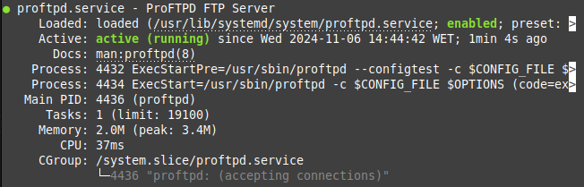
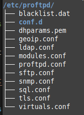

# Instalación del servidor FTP: proFTP

<div align=justify>

## Contenidos

## Descarga e instalación del paquete proFTP

Primeramente actualizamos el repositorio de paquetes: 
```sh
sudo apt-get update
```

Ahora descargamos e instalamos el paquete en nuestro sistema con el comando:
```sh
sudo apt-get install proftpd
```

Comprobamos que está instalando consultando su versión:
```sh
proftpd -v
# Output: ProFTPD Version 1.3.8b
```

Y comprobando su estatus como servicio con `systemctl status proftpd`.

<div align=center>
    
</div>

## Comprobación de los cambios del sistema

Podemos ver cómo la instalación del servicio viene consigo la creación de dos usuarios adicionales, los cuales se pueden comprobar con `cat /etc/passwd`

```sh
proftpd:x:122:65534::/run/proftpd:/usr/sbin/nologin
ftp:x:123:65534::/srv/ftp:/usr/sbin/nologin
```

Al igual que un directorio con sus ficheros de configuración ubicado en `/etc/proftpd`:

<div align=center>
    
</div>

</div>