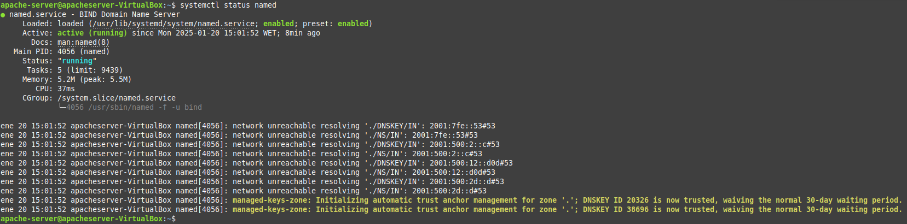
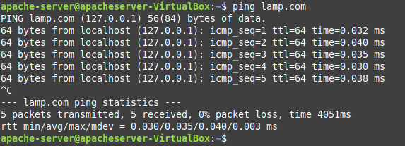

# Instalación de DNS en Ubuntu Server

<div align=center>
        
</div>

# Contenidos

<div align=justify>

- [Introducción](#introducción)
- [Descarga e instalación del paquete Bind9](#descarga-e-instalación-del-paquete-bind9)
- [Configuración mínima de Bind9](#configuración-mínima-de-bind9)
  - [¿Qué significa?](#qué-significa)
- [Configuración de zonas](#configuración-de-zonas)
  - [Estructura de las zonas](#estructura-de-las-zonas)
    - [1. `$TTL 1D`](#1-ttl-1d)
    - [2. Registro SOA (Start of Authority)](#2-registro-soa-start-of-authority)
    - [3. Registros NS (Name Server)](#3-registros-ns-name-server)
    - [4. Registros A (Address)](#4-registros-a-address)
    - [Resumen](#resumen)
- [Comprobaciones y conclusiones](#comprobaciones-y-conclusiones)


## Introducción

Hay muchos paquetes en Linux que implementan la funcionalidad DNS, pero nos enfocaremos en el servidor DNS BIND. Este se usa en la mayoría de los servidores DNS de todo el mundo.

## Descarga e instalación del paquete Bind9

Podemos descargar el paquete del repositorio con:
```sh
sudo apt-get install bind9
```

Una vez completada la instalación, puede iniciar el servicio y habilitarlo para que se ejecute en el momento del inicio.
```sh
sudo systemctl start named
sudo systemctl enable named
```

Podemos comprobar que todo está en funcionamiento accediendo al estado del servicio con:
```sh
systemctl status bind9
```

<div align=center>
    
</div>

Debemos permitir también el acceso al puerto y protocolo que utiliza Bind9 en el firewall de forma sencilla:
```sh
sudo ufw allow bind9

# ----- Output ------
# Reglas actualizadas
# Reglas actualizadas (v6)
```

## Configuración mínima de Bind9

Debemos aplicar una cierta configuración mínima, para eso debemos acceder al fichero de configuración con:
```sh
sudo nano /etc/bind/named.conf.options
```

Y aplicar las siguientes directivas:
```sh
listen-on { any; };
allow-query { localhost; 10.10.20.0/24; };
forwarders {
        8.8.8.8;
        8.8.4.4;
};
dnssec-validation no;
```

### ¿Qué significa?

1. `listen-on { any; };`: Esta línea indica que el servidor DNS escuchará consultas en todas las interfaces de red disponibles. Es decir, aceptará peticiones de cualquier dirección IP.

2. `allow-query { localhost; 10.10.20.0/24; };`: Esta línea especifica qué direcciones IP están permitidas para realizar consultas al servidor DNS. En este caso, solo se permiten consultas desde:
    - localhost (la máquina local, generalmente la dirección IP 127.0.0.1).
    - La red 10.10.20.0/24, que incluye todas las direcciones IP desde 10.10.20.1 hasta 10.10.20.254.

3. `forwarders { 8.8.8.8; 8.8.4.4; };`: Esta línea define los servidores DNS a los que se reenviarán las consultas que el servidor no puede resolver. En este caso, se están utilizando los servidores DNS públicos de Google (8.8.8.8 y 8.8.4.4).

4. `dnssec-validation no;`: Esta línea indica que la validación de DNSSEC (Domain Name System Security Extensions) está desactivada. DNSSEC es un conjunto de extensiones que proporciona seguridad adicional al sistema DNS, y al establecerlo en "no", el servidor no verificará la autenticidad de las respuestas DNS.

Ahora debemos obligar el uso único del IPv4 con:
```sh
sudo nano /etc/default/named
```

Y modificar la linea de `OPTIONS` para dejarla en `OPTIONS="-u bind -4"`.

Luego podemos comprobar si todo fue escrito correctamente y el servicio sigue en funcionamiento.

```sh
sudo named-checkconf
sudo systemctl restart bind9
systemctl status bind9
```

## Configuración de zonas

Debemos acceder a nuestro fichero de configuración para agregar las zonas:
```sh
sudo nano /etc/bind/named.conf.local
```

Dentro del fichero agregamos la zona directa y la zona inversa:

```sh
zone "lamp.com" IN {
        type master;
        file "/etc/bind/zonas/db.lamp.com";
};

zone "99.109.10.in-addr.arpa" {
        type master;
        file "/etc/bind/zonas/db.10.109.99";
};
```

Y ahora crearemos el directorio donde insertaremos la configuración de nuestras zonas:
```sh
sudo mkdir /etc/bind/zonas
```

Así como también los ficheros de configuración con los nombres que necesitamos.
```sh
# Nuestra zona directa
sudo nano /etc/bind/zonas/db.lamp.com
```

Con la siguiente configuración:
```
$TTL    1D
@       IN      SOA     ns1.lamp.com. admin.lamp.com. (
        1               ; Serial
        12h             ; Refresh
        15m             ; Retry
        3w              ; Expire
        2h  )           ; Negative Cache TTL

;       Registros NS

        IN      NS      ns1.lamp.com.
ns1     IN      A       10.109.99.36
www     IN      A       10.109.99.36
```

### Estructura de las zonas

El fragmento que has compartido es un archivo de zona DNS para el dominio `lamp.com`. Vamos a desglosar cada parte para entender su significado y función.

#### 1. `$TTL 1D`

- **`$TTL`**: Esta directiva establece el "Time To Live" (TTL) por defecto para los registros en esta zona. El TTL indica cuánto tiempo (en este caso, 1 día) los servidores DNS y los clientes pueden almacenar en caché la información de esta zona antes de que necesiten volver a consultar el servidor DNS para obtener información actualizada.

#### 2. Registro SOA (Start of Authority)

```plaintext
@       IN      SOA     ns1.lamp.com. admin.lamp.com. (
        1               ; Serial
        12h             ; Refresh
        15m             ; Retry
        3w              ; Expire
        2h  )           ; Negative Cache TTL
```

- **`@`**: Representa el nombre de la zona actual, que en este caso es `lamp.com`.
  
- **`IN SOA`**: Indica que este es un registro SOA (Start of Authority), que es el primer registro en un archivo de zona y proporciona información sobre la zona.

- **`ns1.lamp.com.`**: Este es el servidor de nombres (NS) que es responsable de la zona. En este caso, `ns1.lamp.com` es el servidor de nombres principal.

- **`admin.lamp.com.`**: Este es el correo electrónico del administrador de la zona. En este formato, el símbolo `@` se reemplaza por un punto, por lo que `admin.lamp.com.` se interpreta como `admin@lamp.com`.

- **`( ... )`**: Los valores dentro de los paréntesis son parámetros del registro SOA:
  - **`1`**: Este es el número de serie. Debe incrementarse cada vez que se realice un cambio en la zona para que los servidores secundarios sepan que hay una actualización.
  - **`12h`**: Este es el tiempo de "Refresh", que indica cada cuánto tiempo los servidores secundarios deben consultar al servidor maestro para ver si hay actualizaciones.
  - **`15m`**: Este es el tiempo de "Retry", que indica cuánto tiempo deben esperar los servidores secundarios antes de volver a intentar la consulta si no pueden comunicarse con el servidor maestro.
  - **`3w`**: Este es el tiempo de "Expire", que indica cuánto tiempo los servidores secundarios deben seguir sirviendo la información de la zona si no pueden comunicarse con el servidor maestro.
  - **`2h`**: Este es el "Negative Cache TTL", que indica cuánto tiempo los servidores pueden almacenar en caché las respuestas negativas (por ejemplo, si un nombre no existe).

#### 3. Registros NS (Name Server)

```plaintext
;       Registros NS
        IN      NS      ns1.lamp.com.
```

- **`; Registros NS`**: Este es un comentario que indica que los siguientes registros son registros de servidor de nombres (NS).

- **`IN NS ns1.lamp.com.`**: Este registro indica que `ns1.lamp.com` es un servidor de nombres autorizado para la zona `lamp.com`.

#### 4. Registros A (Address)

```plaintext
ns1     IN      A       10.109.99.36
www     IN      A       10.109.99.36
```

- **`ns1 IN A 10.109.99.36`**: Este registro A asocia el nombre `ns1.lamp.com` con la dirección IP `10.109.99.36`. Esto significa que cuando alguien consulta `ns1.lamp.com`, se le devolverá la dirección IP `10.109.99.36`.

- **`www IN A 10.109.99.36`**: Este registro A asocia el nombre `www.lamp.com` también con la dirección IP `10.109.99.36`. Esto significa que tanto `ns1.lamp.com` como `www.lamp.com` apuntan a la misma dirección IP.

#### Resumen

En resumen, este archivo de zona define la configuración DNS para el dominio `lamp.com`. Incluye información sobre el servidor de nombres principal, el administrador de la zona, los tiempos de actualización y expiración, y los registros que asocian los nombres de dominio `ns1.lamp.com` y `www.lamp.com` con la dirección IP `10.109.99.36`. Esta configuración es esencial para que los clientes y otros servidores DNS puedan resolver correctamente los nombres de dominio a direcciones IP.

Ahora crearemos nuestro fichero de configuración de la zona inversa:

```sh
sudo nano /etc/bind/zonas/db.99.109.10
```

Con el siguiente contenido:
```
$TTL    1d ;
@       IN      SOA     ns1.lamp.com admin.lamp.com. (
                        20210222        ; Serial
                        12h             ; Refresh
                        15m             ; Retry
                        3w              ; Expire
                        2h      )       ; Negative Cache TTL
;
@      IN      NS      ns1.lamp.com.
1       IN      PTR     www.lamp.com.
```

## Comprobaciones y conclusiones

</div>

> [!WARNING]
> Es importante la sintaxis de los ficheros de configuración. Un mínimo error puede causar que no funcione bien el servicio y explote tu ordenador.

<div align=justify>

Comprobamos la sintaxis de los ficheros de configuración con:
```sh
sudo named-checkzone lamp.com /etc/bind/zonas/db.lamp.com
# --- Output ---
# zone lamp.com/IN: loaded serial 1
# OK

sudo named-checkzone db.10.109.99.in-addr.arpa /etc/bind/zonas/db.99.109.10
# --- Output ---
# zone db.10.109.99.in-addr.arpa/IN: loaded serial 20210222
# OK
```

Finalmente, podemos comprobar con todo ha funcionado con:
```sh
ping lamp.com
```

<div align=center>
        
</div>

</div>