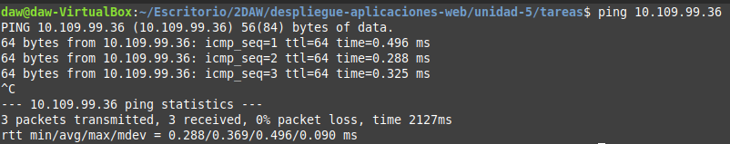

# OpenLDAP: Instalación y configuración

<div align=center>
    
</div>

<div align=justify>

# Contenidos

- [Introducción](#introducción)
- [Instalación de los paquetes](#instalación-de-los-paquetes)
- [Configuración de los paquetes](#configuración-de-los-paquetes)
- [Creación de la unidad organizativa](#creación-de-la-unidad-organizativa)
  - [1. Crear plantilla](#1-crear-plantilla)
  - [2. Añadimos la unidad](#2-añadimos-la-unidad)


## Introducción

Para esta práctica es necesario tener preparado un par de máquinas virtuales: una máquina server y un cliente, conexión a internet y conectividad entre ambas máquinas.

Podemos comprobar esto realizando un simple `ping` a la ip de nuestro servidor y comprobando si hay transferencia de paquetes.

<div align=center>
    
</div>

Otra cosa que necesitamos preparar (en caso de no tener configurado previamente) es el *hostname* de nuestro servidor usando `hostnamectl`. En mi caso:

```sh
sudo hostnamectl set-hostname apacheserver.jesus.local
```

Así como también el ajuste en `/etc/hosts` necesario para el buen funcionamiento de nuestro servidor.

```sh
# /etc/hosts
127.0.0.1   locahost
127.0.1.1   apacheserver.jesus.local
10.109.99.36    apacheserver.jesus.local
```

## Instalación de los paquetes

Primeramente, como siempre, actualizaremos el repositorio de paquetes de nuestro sistema operativo:
```sh
sudo apt-get update -y
```

Luego instalamos los siguientes paquetes:
```sh
sudo apt-get install slapd ldap-utils -y
```

## Configuración de los paquetes

Ahora necesitamos los paquetes que acabamos de instalar, para eso, ejecutamos:
```sh
sudo dpkg-reconfigure slapd
```

Después de haber configurado todo correctamente según nuestras necesidades, podemos comprobar la configuración con:
```sh
sudo slapcat
```

Y el comando anterior nos debería dar algo como:
```sh
dn: dc=jesus,dc=local
objectClass: top
objectClass: dcObject
objectClass: organization
o: jesus.local
dc: jesus
structuralObjectClass: organization
entryUUID: 7e1561ec-72a3-103f-9799-654519ec3a76
creatorsName: cn=admin,dc=jesus,dc=local
createTimestamp: 20250129154312Z
entryCSN: 20250129154312.833672Z#000000#000#000000
modifiersName: cn=admin,dc=jesus,dc=local
modifyTimestamp: 20250129154312Z
```

## Creación de la unidad organizativa

Para la práctica es necesaria la creación de la unidad organizativa aplicada en la guia otorgada: para crear una, debemos hacer los siguientes pasos.

### 1. Crear plantilla

Crearemos una plantilla para, posteriormente, crear unidades organizativas. Para ello, hacemos:
```sh
sudo nano ou.ldif
```

E insertamos como contenido:
```conf
dn: ou=informatica,dc=clockwork,dc=local
objectClass: top
objectClass: organizationalUnit
ou: informatica
```

### 2. Añadimos la unidad

Con:
```sh
sudo ldapadd -x -D cn=admin,dc=clockwork,dc=local -W -f ou.ldfi
```

Desplegando este comando:

`ldapadd`: comando base para agregar una entrada al servidor LDAP.

`-x`: Esta opción indica que se debe usar la autenticación simple en lugar de SASL (Simple Authentication and Security Layer).

`-D cn=admin,dc=clockwork,dc=local`: Esta opción especifica el DN (Distinguished Name) del usuario que se está autenticando. En este caso, se está utilizando el usuario admin en el dominio clockwork.local.

`-W`: Esta opción indica que se debe solicitar la contraseña del usuario especificado en el DN anterior. Al usar esta opción, el sistema pedirá que ingreses la contraseña de admin.

`-f ou.ldif`: Esta opción especifica el archivo que contiene las entradas LDAP que se desean agregar o modificar. En este caso, el archivo se llama ou.ldif.


</div>
