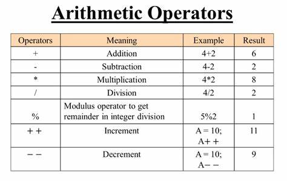

# JavaScript

A continuación dejo un resumen de las cosas vistas en la página de JavaScript de W3Schools:

### Variables

- Las variables antes de usarse deben declararse con `var`, `let` o `const` (la diferencia entre `var` y `let` es su funcionamiento en navegadores antigüos; por lo general se usa más `let`).
- Las variables se pueden declarar en una misma linea, separando con la coma (,)
- `const` se usa para declarar constantes.

```js
var first_name = "Juanito"
let last_name = "Pérez"
const year = 1999
```

### Operadores

Son exactamente iguales a los de Python, asi que sin rayarse. 

<div align=center>
    
</div>

También sirven las variantes de +=, -=, *=, /=

### Tipos de datos

```js
// Numbers:
let length = 16;
let weight = 7.5;

// Strings:
let color = "Yellow";
let lastName = "Johnson";

// Booleans
let x = true;
let y = false;

// Object: (son similares a los diccionarios de Python)
const person = {firstName:"John", lastName:"Doe"};

// Array object: 
const cars = ["Saab", "Volvo", "BMW"];

// Date object:
const date = new Date("2022-03-25");
```

- Las variables son de tipos dinámicos, por lo que puedes declararla al inicio con un valor numérico y luego cambiarlo a un String.

### Funciones

```js
// Function to compute the product of p1 and p2
function myFunction(p1, p2) {
  return p1 * p2;
}

// Calling the function
let x = 10
let y = 2
let z = myFunction(x, y)
// Variable z == 20
```

- Los "espacios de nombres" que vimos en Python también aplican aquí, por lo que una variable declarada dentro de una función no puede ser llamada afuera de ella.

### "Objetos"

Se declaran y comportan de forma similar a los diccionarios de Python.

```js
// Create an Object with properties
const person = {
  firstName: "John",
  lastName: "Doe",
  age: 50,
  eyeColor: "blue"
};

// Create an Object without properties 
const person = {};
// Add Properties
person.firstName = "John";
person.lastName = "Doe";
person.age = 50;
person.eyeColor = "blue";
```

El acceso a las propiedades de un objeto se puede hacer de dos formas:

1. `objectName.propertyName`
2. `objectName["propertyName"]`

También pueden almacenar funciones que retornen propiedades, de forma similar a como funciona una _property_ dentro de una clase de Python.

```js
const person = {
  firstName: "John",
  lastName : "Doe",
  id       : 5566,
  fullName : function() {
    return this.firstName + " " + this.lastName;
  }
};  
```

### Eventos

Los eventos en HTML son "sucesos" o acciones que pueden ser captados por JavaScript para ejecutar parte de su código, como clickear en cierta parte, colocar el mouse encima, redimensionar la ventana...
El código HTML permite ejecutar JavaScript tras eventos en sus propias etiquetas, de forma similar a como se usa el atributo 'style' en una etiqueta para modificar el CSS, usando los nombres de eventos. Por ejemplo:

```html
<button onclick="document.getElementById('demo').innerHTML = Date()">The time is?</button>
```
En este ejemplo, tenemos un botón que dice "The time is?" que al presionar (evento _onclick_), cogerá de todo el documento HTML, el elemento con ID "demo" (`getElementById('demo')`) y modificará el interior del elemento (_innerHTML_) con un nuevo `Date()` (la fecha actual).

#### Eventos comunes

|Evento|Descripción|
|------|-----------|
|onchange|Cuando el elemento HTML ha sido cambiado.|
|onclick|Cuando el usuario clickea sobre el elemento.|
|onmouseover|Cuando el usuario mueve el mouse sobre el elemento.|
|onmouseout|Cuando el usuario mueve el mouse fuera del elemento.|
|onkeydown|Cuando el usuario presiona una tecla.|
|onload|Cuando el navegador termina de cargar la página web.|

### Objeto MATH

En JavaScript existe un objeto Math que es utilizado para distintas funciones relacionadas con las matemáticas gracias a sus métodos y constantes.

```js
Math.E        // returns Euler's number
Math.PI       // returns PI
Math.SQRT2    // returns the square root of 2
Math.SQRT1_2  // returns the square root of 1/2
Math.LN2      // returns the natural logarithm of 2
Math.LN10     // returns the natural logarithm of 10
Math.LOG2E    // returns base 2 logarithm of E
Math.LOG10E   // returns base 10 logarithm of E
```

<table>
  <tr>
    <th style="width:20%">Method</th>
    <th>Description</th>
  </tr>
  <tr>
    <td>abs(x)</td>
    <td>Returns the absolute value of x</td>
  </tr>
  <tr>
    <td>acos(x)</td>
    <td>Returns the arccosine of x, in radians</td>
  </tr>
  <tr>
    <td>acosh(x)</td>
    <td>Returns the hyperbolic arccosine of x</td>
  </tr>
  <tr>
    <td>asin(x)</td>
    <td>Returns the arcsine of x, in radians</td>
  </tr>
  <tr>
    <td>asinh(x)</td>
    <td>Returns the hyperbolic arcsine of x</td>
  </tr>
  <tr>
    <td>atan(x)</td>
    <td>Returns the arctangent of x as a numeric value between -PI/2 and PI/2 radians</td>
  </tr>
  <tr>
    <td>atan2(y, x)</td>
    <td>Returns the arctangent of the quotient of its arguments</td>
  </tr>
  <tr>
    <td>atanh(x)</td>
    <td>Returns the hyperbolic arctangent of x</td>
  </tr>
  <tr>
    <td>cbrt(x)</td>
    <td>Returns the cubic root of x</td>
  </tr>
  <tr>
    <td>ceil(x)</td>
    <td>Returns x, rounded upwards to the nearest integer</td>
  </tr>
  <tr>
    <td>cos(x)</td>
    <td>Returns the cosine of x (x is in radians)</td>
  </tr>
  <tr>
    <td>cosh(x)</td>
    <td>Returns the hyperbolic cosine of x</td>
  </tr>
  <tr>
    <td>exp(x)</td>
    <td>Returns the value of E<sup>x</sup></td>
  </tr>
  <tr>
    <td>floor(x)</td>
    <td>Returns x, rounded downwards to the nearest integer</td>
  </tr>
  <tr>
    <td>log(x)</td>
    <td>Returns the natural logarithm (base E) of x</td>
  </tr>
  <tr>
    <td>max(x, y, z, ..., n)</td>
    <td>Returns the number with the highest value</td>
  </tr>
  <tr>
    <td>min(x, y, z, ..., n)</td>
    <td>Returns the number with the lowest value</td>
  </tr>
  <tr>
    <td>pow(x, y)</td>
    <td>Returns the value of x to the power of y</td>
  </tr>
  <tr>
    <td>random()</td>
    <td>Returns a random number between 0 and 1</td>
  </tr>
  <tr>
    <td>round(x)</td>
    <td>Rounds x to the nearest integer</td>
  </tr>
  <tr>
    <td>sign(x)</td>
    <td>Returns if x is negative, null or positive (-1, 0, 1)</td>
  </tr>
  <tr>
    <td>sin(x)</td>
    <td>Returns the sine of x (x is in radians)</td>
  </tr>
  <tr>
    <td>sinh(x)</td>
    <td>Returns the hyperbolic sine of x</td>
  </tr>
  <tr>
    <td>sqrt(x)</td>
    <td>Returns the square root of x</td>
  </tr>
  <tr>
    <td>tan(x)</td>
    <td>Returns the tangent of an angle</td>
  </tr>
  <tr>
    <td>tanh(x)</td>
    <td>Returns the hyperbolic tangent of a number</td>
  </tr>
  <tr>
    <td>trunc(x)</td>
    <td>Returns the integer part of a number (x)</td>
  </tr>
  </table>


### Switch 

El Switch de JavaScript es ligeramente distinto al de Python:

```js
switch(expression) {
  case x:
    // code block
    break;
  case y:
    // code block
    break;
  default:
    // code block
}
```

### Bucles

#### Bucle For
```js
for (expression 1; expression 2; expression 3) {
  // code block to be executed
}

for (let i = 0; i < 5; i++) {
    text += "The number is " + i + "<br>";
}

// expression 1: se define la variable auxiliar a 0
// expression 2: se define la condición para correr el bucle (la variable auxiliar debe ser menor que 5)
// expression 3: incrementa el valor de la variable auxiliar con cada iteración.
```

#### Bucles For/In
__Para recorrer las keys de un objeto__:
```js
for (key in object) {
  // code block to be executed
}

// Example
const person = {fname:"John", lname:"Doe", age:25};

let text = "";
for (let x in person) {
  text += person[x];
}
```
__Para recorrer los valores de una lista__:
```js
for (variable in array) {
  // code
}

const numbers = [45, 4, 9, 16, 25];

let txt = "";
for (let x in numbers) {
  txt += numbers[x];
}
```