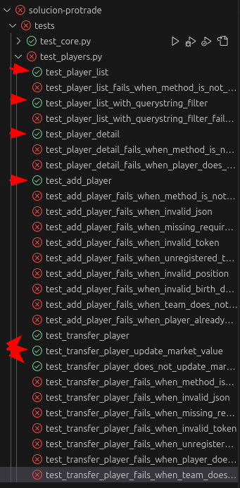

# Explicación del examen - Parte 2

- [URLs](#urls)
  - [Identificar urls de primer nivel (main.urls)](#identificar-urls-de-primer-nivel-mainurls)
  - [Identificar urls de segundo nivel (players.urls)](#identificar-urls-de-segundo-nivel-playersurls)
  - [Notas importantes](#notas-importantes)
  - [Completado de URLPatterns](#completado-de-urlpatterns)
- [Vistas - Funcionamiento base](#vistas---funcionamiento-base)
  - [1. player\_list](#1-player_list)
  - [2. player\_list con querystring](#2-player_list-con-querystring)
  - [3. player\_detail](#3-player_detail)
  - [4. add\_player](#4-add_player)
  - [5. transfer\_player](#5-transfer_player)
- [Tests pasados](#tests-pasados)


## URLs

> [!NOTE]
> A partir de aqui, vayan viendo los archivos del ejercicio como tal, primero porque me da pereza ir copiando y pegando aqui cuando está en los archivos como tal, y segundo, porque a veces ni hará falta.

### Identificar urls de primer nivel (main.urls)

Como estamos desarrollando una API, practicamente todas las urls empiezan con `api/`, en nuestro caso, solamente hay urls de `api/players/`. Por lo que en [main/urls.py](../main/urls.py) solo incluiremos las urls de players con el `include`. Por eso **recomiendo echar un vistazo para sacar las urls principales** y así armar el fichero principal de urls. Si, por ejemplo, viésemos una vista de "Team List" con url `api/teams/`, sabemos que esa url irá en la app de teams, por lo que la incluiriamos en el `main.urls` con `path('api/teams/', include('teams.urls'))`.

### Identificar urls de segundo nivel (players.urls)

Una cosa que, personalmente, se me hace más sencillo de trabajar, es antes de ponerme a trabajar con las vistas, completar los archivos de urls para después despreocuparme de ellos. Para eso nos toca leer e identificar las urls que utilizaremos y crear las vistas vacías para asignarlas a las urls.

Leyendo el PDF que Sergio nos da, tenemos:
1. `api/players/`, que te envía a una vista `player_list`.
2. `api/players/?position=M&team=real-sociedad`, que te envía a la misma vista `player_list`.
3. `api/players/lamine-yamal/` que te envía a la vista `player_detail`.
4. `api/players/add/` que te envía a la vista `add_player`.
5. `api/players/transfer/` que te envía a la vista `transfer_player`.

### Notas importantes

De aqui podemos determinar que:
1. La segunda url hace referencia a una **búsqueda querystring**. Esto se sabe porque hay un signo de interrogación en la URL. Todo lo que se encuentre después del **?** ya son valores de búsqueda: en el caso del PDF está buscando todos los jugadores **cuya posición sea M y su equipo sea de la Real Sociedad.**
2. El "lamine-yamal" del tercer url es claramente un slug de un jugador Lamine Yamal, por lo tanto se reemplaza con `<slug:player_slug>`

### Completado de URLPatterns

Si añadimos esto a nuestro fichero `players/urls.py`, terminaría como:

```py
from django.urls import path

from . import views

app_name = 'players'

urlpatterns = [
    path('', views.player_list, name='player-list'),
    path('add/', views.add_player, name='add-player'),
    path('transfer/', views.transfer_player, name='transfer-player'),
    path('<slug:player_slug>/', views.player_detail, name='player-detail'),
]
```

> [!WARNING]
> **El orden de las URLs es importante**, hay que procurar dejar las urls de slug al final porque, si lo dejamos al principio y accedemos a `api/players/add/`, el programa verá por orden las urls y al encontrarse con `<player_slug>`, entenderá que "add" es un slug e intentará usar la vista de player_detail con "add" como slug, en vez de usar la vista de add_player. Lo mismo con `api/players/transfer/`.

## Vistas - Funcionamiento base

A mi me me gusta separar este trabajo en dos partes: **crear el funcionamiento básico** y **controlar errores**.

> [!NOTE]
> La etapa de controlar errores se hará en la tercera parte de esta guia, porque me estoy extendiendo demasiado xd.

> [!NOTE]
> Es fundamental saber que lo que retornaremos mientras trabajamos en una API **casi siempre** serán **JSON responses**, ya sean armadas manualmente con `JSONResponse(...)` o generadas por los serializadores con sus métodos `json_response()`.

### 1. player_list

Las indicaciones de Sergio simplemente son: "Listado de jugadores disponibles en el sistema".

Esto es, básicamente, **todos los jugadores** de la base de datos, o mejor dicho, en el **modelo Player**. Esto se puede obtener con `Player.objects.all()`. Si esto lo pasamos al serializador `PlayerSerializer` y lo devolvemos quedaría tal que así:

```py
def player_list(request: HttpRequest):
    # 1. Obtenemos todos los jugadores del modelo Player
    players = Player.objects.all()
    # 2. Creamos el serializador pasándole los jugadores y el request
    serializer = PlayerSerializer(players, request=request)
    # 3. Devolvemos como respuesta el json_response
    return serializer.json_response()
```

Ya con esto, el test básico de `test_player_list` debería funcionar.

### 2. player_list con querystring

Las búsquedas de querystring son simplemente **filtros que afectan la búsqueda inicial**. Por cada elemento que exista en el querystring, debe aplicarse un filtro.

> [!IMPORTANT]
> Debemos tener en cuenta que estos elementos están dentro de `request.GET` y debemos obtenerlos con un método `get(...)`.

En palabras de Sergio: `position` y `team` son los parámetros del querystring. Por lo tanto, debemos aplicar dos filtros, los cuales son, simplemente, dos lineas cada uno.

```py
if query := request.GET.get('query_name'):
    objects = objects.filter(...)
```

Por ejemplo, para aplicar el filtro de `position`, sería algo como:

```py
if position_query := request.GET.get('position'):
    players = players.filter(position=position_query)
```

Pero para `team` es algo un poco distinto, porque en el modelo `Player`, el campo `team` no es un texto ni un número como `position` que es un CharField, sino que es un Foreign Key. Lo que nos dan en el querystring (lo dice Sergio en el PDF) es **el slug del equipo**. Por lo tanto **debemos acceder primero al objeto team y luego a su slug en el filtro**. Eso se hace con doble barra baja "__".

```py
if team_query := request.GET.get('team'):
    players = players.filter(team__slug=team_query)
```

Si aplicamos ambas cosas a nuestra vista `player_list`, terminaría como:

```py
def player_list(request: HttpRequest) -> JsonResponse:
    # 1. Primero obtenemos todos los jugadores del modelo
    players = Player.objects.all()
    # 2. Si se está buscando jugadores según posición...
    if position_query := request.GET.get('position'):
        # Se aplica el filtro (si no, sigue de largo al siguiente if)
        players = players.filter(position=position_query)
    # 3. Si se está buscando jugadores según su equipo...
    if team_query := request.GET.get('team'):
        # Se aplica el filtro (si no, sigue de largo a la creación del serializer)
        players = players.filter(team__slug=team_query)
    # 4. Se crea el serializador con los jugadores (ya filtrados o no)
    serializer = PlayerSerializer(players, request=request)
    # 5. Se devuelve el json_response del serializador.
    return serializer.json_response()
```

### 3. player_detail

Esto es básicamente devolver la información de un jugador, y ese jugador se obtiene con el slug pasado por la url.

```py
def player_detail(request: HttpRequest, player_slug: str):
    player = Player.objects.get(slug=player_slug)
    serializer = PlayerSerializer(player, request=request)
    return serializer.json_response()
```

### 4. add_player

Esta es la primera vista que nos encontramos **de petición POST**: esto lo sabemos porque se trata de **añadir** un jugador. Por el momento ignoraremos los errores y los temas relacionados con la autenticación y nos enfocaremos en que funcione la base.

**Para las peticiones POST debemos entender lo siguiente:** la información que nos pasan no es a través de la URL, como se pasa el `player-slug` en la vista anterior, sino que se hace a través del contenido de la petición, del `body`. **Se puede acceder a esta información cargándola con `json.loads(request.body)` y guardandola en una variable como diccionario**.

Ya sabiendo esto podemos aplicarlo en nuestra vista. Pero hay que tener en cuenta algunas cosas:

1. "`birth-date` se enviará en formato ISO 8601. El método fromisoformat() te puede ayudar a convertirlo.": esto se refiere a, literalmente, usar esa función para convertir la información del request.body en un objeto `Date` de Python que sí es compatible con el modelo.
2. El `team-slug` que nos pasan por `request.body` no es compatible con el campo `team` del modelo `Player`: hay que recordar que este campo es una Foreign Key. Por lo tanto debemos usar ese `team-slug` para obtener el objeto del modelo `Team`. 

```py
def add_player(request: HttpRequest):
    # 1. Cargamos y guardamos los datos del POST
    json_data = json.loads(request.body)
    # 2. Obtenemos el equipo donde se añadirá (porque lo que nos pasan por POST es el slug y lo que necesitamos es el objeto Team)
    team = Team.objects.get(slug=json_data['team-slug'])
    # 3. Convertimos la fecha de nacimiento pasada en el formato compatible
    birth_date = date.fromisoformat(json_data['birth-date'])
    # 4. Creamos el jugador en el modelo rellenando los datos que necesita con los datos sacados del json_data, la fecha convertida y el equipo sacado del modelo Team.
    player = Player.objects.create(
        name=json_data['name'],
        slug=json_data['slug'],
        position=json_data['position'],
        birth_date=birth_date,
        market_value=json_data['market-value'],
        team=team,
    )
    # 5. Devolvemos lo que la vista nos pide -> id(pk-player) -> Un diccionario con clave "id" y su valor es la pk del player recién creado.
    return JsonResponse({'id': player.pk})
```

> [!WARNING]
> Hay que tener en cuenta que debemos hacer un `import json` para realizar la carga y guardado de datos de la petición, y un `from datetime import date` para usar `date.fromisoformat` y convertir la fecha en el formato compatible.

###  5. transfer_player

Tenemos que entender el objetivo de esta vista analizándola: **debemos cambiar el equipo del jugador a otro equipo, y si este equipo es de otra liga, el valor de mercado se incrementará un 10%**.

De esto podemos sacar una conclusión clara: se trata de otra vista con petición POST, pues estamos modificando datos. Viendo la tabla que nos proporciona Sergio, vemos que la información que nos da a través del `request.body` O `POST request` es el `player-slug` y `team-slug`. 

Por lo tanto lo que debemos hacer primeramente es cargar y guardar los datos de la petición:

```py
json_data = json.loads(request.body)
```

Luego obtenemos el jugador que se le cambiará el equipo con:

```py
player = Player.objects.get(slug=json_data['player-slug'])
```

Luego el equipo a donde será trasladado:

```py
new_team = Team.objects.get(slug=json_data['team-slug'])
```

Y finalmente hacer el cambio de equipo:

```py
player.team = new_team
player.save()
```

Todo esto va bien **excepto que no estamos incrementando en ningún lado el valor del mercado**. Para esto debemos identificar la condición que debe cumplirse, la cual es sencilla: el equipo debe ser de otra liga. Para saber eso basta con preguntar si la liga de ambos es distinta **ANTES DE HACER EL TRASLADO**.

```py
# Si la liga del equipo actual del jugador es distinta al del equipo nuevo...
if player.team.league != new_team.league:
    # Incrementa el valor de mercado en un 10%
    player.market_value += player.market_value * Decimal(0.1)
```

> [!NOTE]
> Hay que tener en cuenta que el campo `market_value` del modelo es un `DecimalField` y este no es compatible con el `float` de Python. Para solucionar eso debemos convertir el valor `float` en `Decimal`, importando primero `from decimal import Decimal` y luego usando `Decimal(float-value-here)`.

Si unimos todo esto en nuestra vista, quedaría tal que así:

```py
def transfer_player(request: HttpRequest):
    # 1. Cargamos y guardamos los datos de la petición
    json_data = json.loads(request.body)
    # 2. Buscamos el jugador con el slug
    player = Player.objects.get(slug=json_data['player-slug'])
    # 3. Buscamos el equipo al que será trasladado
    new_team = Team.objects.get(slug=json_data['team-slug'])
    # 4. Comprobamos si los equipos son de distintas ligas para aumentar el valor de mercado
    if player.team.league != new_team.league:
        player.market_value += player.market_value * Decimal(0.1)
    # 5. Asignamos el nuevo equipo del jugador
    player.team = new_team
    # 6. Guardamos los cambios
    player.save()
    # 7. Devolvemos lo que nos pide la vista
    return JsonResponse({'id': player.pk})
```

## Tests pasados

Ya tras haber realizado todo lo indicado anteriormente tendriamos terminado el funcionamiento básico de todas las vistas y lo podemos comprobar en los tests, siendo los cumplidos **13/33**. Ya los que quedan son los de **controlar errores**.

<div align=center>
    
</div>