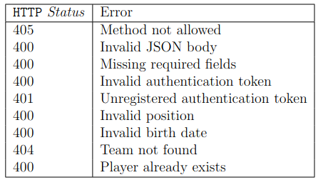
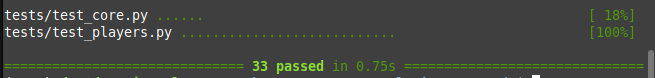

# Explicación del examen - Parte 3

- [Vistas - Control de errores](#vistas---control-de-errores)
- [¿Solución en decoradores o en la propia vista?](#solución-en-decoradores-o-en-la-propia-vista)
    - [Ejemplo con Try-Except](#ejemplo-con-try-except)
    - [Ejemplo con bloque IF](#ejemplo-con-bloque-if)
- [Errores generales](#errores-generales)
  - [Method not allowed - 405](#method-not-allowed---405)
    - [Método GET](#método-get)
    - [Método POST (es prácticamente igual solo que cambiando 'GET' por 'POST')](#método-post-es-prácticamente-igual-solo-que-cambiando-get-por-post)
  - [Invalid JSON body - 400](#invalid-json-body---400)
  - [Missing required fields - 400](#missing-required-fields---400)
    - [Solución en decorador](#solución-en-decorador)
    - [Solución en vista](#solución-en-vista)
  - [Invalid Y Unregistered Authentication Token - 400 y 401](#invalid-y-unregistered-authentication-token---400-y-401)
- [Errores específicos](#errores-específicos)
    - [¿Errores "Not Found" cómo específicos?](#errores-not-found-cómo-específicos)
  - [player\_detail -\> Player Not Found - 404](#player_detail---player-not-found---404)
  - [add\_player -\> Invalid Position - 400](#add_player---invalid-position---400)
  - [add\_player -\> Invalid birth date - 400](#add_player---invalid-birth-date---400)
  - [add\_player -\> Team Not Found - 404](#add_player---team-not-found---404)
  - [add\_player -\> Player already exists - 400](#add_player---player-already-exists---400)
  - [transfer\_player -\> Player Not Found - 404](#transfer_player---player-not-found---404)
  - [transfer\_player -\> Team Not Found - 404](#transfer_player---team-not-found---404)
- [La importancia del orden en el manejo de errores](#la-importancia-del-orden-en-el-manejo-de-errores)
- [Tests pasados](#tests-pasados)
- [Conclusión](#conclusión)

## Vistas - Control de errores

Ya después de tener la base de nuestra aplicación en funcionamiento toca la última parte: controlar los errores. Tenemos que tener en cuenta, para sacar la mayoría de tests rápidamente, que podemos dividir esta etapa en resolver dos tipos de errores: **los generales y los específicos**.

Los **errores generales** son esos que se repiten entre las vistas y resolverlos implica pasar varios tests a la vez, mientras que los **errores específicos** son los que se presencian solamente en un par de vistas como mucho.

> [!NOTE]
> Estos términos me los acabo de inventar por quedar de inteligente, a que se te torció el ojo.

**Ya sabiendo esto debemos intentar resolver primero los errores generales para solucionar tests más rápidamente y dejar de último los específicos.**

A continuación los errores que podemos encontrar, **ordenados de más generales a más específicos**, mostrando así cómo vamos resolviendo más tests rápidamente.

## ¿Solución en decoradores o en la propia vista?

Esto es muy subjetivo, pero lo más eficiente y "pitónico" según el Sergio es que, **si se repite el error, es mejor controlarlo a través de un decorador**. Así reducimos la cantidad de código visible en la vista, luce todo más limpio y es más eficiente de aplicar.

**Lo habitual es que los errores generales sean resueltos con decoradores**, como por ejemplo el de **Method not allowed**.

```py
# Este decorador controla el error para que requiera métodos POST, y cómo se presenta en varias vistas, es más fácil de aplicar esa linea.
@require_post_method
def add_player(request):
    ...
```

**Y los errores específicos se resuelve en bloques de IF o Try-Except, que son las llamadas clausuras guardas.** Como en los siguientes ejemplos.

#### Ejemplo con Try-Except

```py
@require_get_method
def player_detail(request: HttpRequest, player_slug: str):
    try:
        # 1. Intenta obtener el jugador del modelo con el slug pasado por la url.
        player = Player.objects.get(slug=player_slug)
        # 2. Si no existe el jugador, el modelo arrojará un error DoesNotExist que la linea de except cogerá.
    except Player.DoesNotExist:
        # 3. Si cogió el error es porque no existe el jugador, por lo tanto hay que devolver la salida que Sergio exige.
        return JsonResponse({'error': 'Player not found'}, status=404)
    
    # 4. En cambio, si el jugador existe en el modelo, no se arrojará el error, no entrará en la línea del except y seguirá por aquí con normalidad teniendo el jugador guardado en la variable "player"
```

#### Ejemplo con bloque IF

```py
@require_post_method
def add_player(request: HttpRequest):
    # 1. Se carga y guarda la información del body pasada en POST
    json_data = json.loads(request.body)
    # 2. Si la posición pasada por POST no está en las posiciones posibles...
    if json_data['position'] not in Player.Position:
        # 3. Es porque la posición es inválida. Por lo tanto hay que devolver lo que Sergio exige.
        return JsonResponse({'error': 'Invalid position'}, status=400)
    
    # 4. Si la posición pasada es válida, no entrará en la clausura guarda y seguirá el código normalmente.
```

## Errores generales

### Method not allowed - 405

Este error se arroja cuando **una vista recibe una petición de un tipo distinto al que se espera**. Como hablamos antes, **las peticiones GET son para lectura de datos y las peticiones POST son para escritura de datos**. Entonces si una vista va de modificar, por ejemplo, el equipo de un jugador, se supone que la vista recibirá peticiones POST, pero si en su lugar recibe una petición GET, debería arrojar este error.

**Lo vamos a resolver creando un par de decoradores en el fichero `shared/utils.py`.**

#### Método GET

```py
def require_get_method(func):
    def wrapper(*args, **kwargs):
        # 1. Sacamos el "request" de la vista desde los args
        request = args[0]
        # 2. Si el método del request es distinto de GET...
        if request.method != 'GET':
            # 3. Devolvemos el error que Sergio exige.
            return JsonResponse({'error': 'Method not allowed'}, status=405)
        # 4. Si el método es GET, no entrará por el IF y ejecutará el resto de la vista de forma normal.
        return func(*args, **kwargs)
    return wrapper
```

#### Método POST (es prácticamente igual solo que cambiando 'GET' por 'POST')

```py
def require_post_method(func):
    def wrapper(*args, **kwargs):
        # 1. Sacamos el "request" de la vista desde los args
        request = args[0]
        # 2. Si el método del request es distinto de POST...
        if request.method != 'POST':
            # 3. Devolvemos el error que Sergio exige.
            return JsonResponse({'error': 'Method not allowed'}, status=405)
        # 4. Si el método es POST, no entrará por el IF y ejecutará el resto de la vista de forma normal.
        return func(*args, **kwargs)
    return wrapper
```

Ahora aplicamos esto en las vistas importándolas y colocando los respectivos decoradores según el tipo que requieren. Ya después de esto podemos ver los tests y observar que se han cumplido un par de tests más. Ahora desde la última vez que probamos los tests **(13/33)**, hemos subido a **18/33**.

### Invalid JSON body - 400

**Este es otro decorador** que comprueba si al cargar los datos de la petición no está mal armado.

```py
def validate_json_body(func):
    def wrapper(*args, **kwargs):
        # 1. Cogemos el request de la vista
        request = args[0]
        try:
            # 2. Cargamos los datos de la petición
            json.loads(request.body)
            # 3. Si los datos están mal construidos, arrojará el error JSONDecodeError.
        except json.JSONDecodeError:
            # 4. Si el error es arrojado, se devuelve el resultado que Sergio exige.
            return JsonResponse({'error': 'Invalid JSON body'}, status=400)
        # 5. Si está bien armado, pasará del bloque except y seguirá la vista con su funcionamiento normal
        return func(*args, **kwargs)
    return wrapper
```

Comprobamos los tests y ha avanzado de **18/33** a **20/33**.

### Missing required fields - 400

Este error se arroja cuando, para funcionar la vista, **necesita información pero esta no es enviada en la petición**. **Como se aplica en varias vistas, haremos un decorador.**

> [!TIP]
> También puedes ahorrarte la complejidad del decorador y **aplicar el código directamente en la vista**; así también reduces posibilidades de que, si hay varias personas leyendo esta vaina escrita por mi, hagan todos lo mismo y haya riesgo de que Sergio sospeche de copia. **Simio no mata simio**.

#### Solución en decorador

```py
############### En shared/utils.py ####################

# 1. Creamos un decorador que coja de parámetro una lista de string, que serán los campos de información que necesitamos para que la vista funcione.
def get_json_fields(*fields: str):
    def decorator(func):
        def wrapper(*args, **kwargs):
            # 2. Como siempre, cogemos el request de la vista para cargar los datos.
            request = args[0]
            # 3. Cargamos y guardamos los datos.
            json_body = json.loads(request.body)
            # 4. Recorremos LOS CAMPOS QUE NECESITAMOS y preguntamos...
            for field in fields:
                # 5. ¿Este campo que necesito NO ESTÁ en los campos que me estás pasando?
                if field not in json_body.keys():
                    # 6. Si no está el campo que necesitamos, ya nuestra vista no funcionará, por lo tanto arrojamos el error.
                    return JsonResponse({'error': 'Missing required fields'}, status=400)
            # 7. Si después de recorrer todos los campos que necesitamos no falta ninguno, sigue la vista con su funcionamiento normal.
            return func(*args, **kwargs)
        return wrapper
    return decorator

########### En players/views.py ###############

# Importamos y aplicamos el decorador pasándole los campos que necesita la vista para funcionar
@require_post_method
@validate_json_body
@get_json_fields('name', 'slug', 'position', 'birth-date', 'market-value', 'team-slug')
def add_player(request: HttpRequest):
    ...
```

#### Solución en vista

El código del decorador se puede aplicar en la misma vista, aunque tocaría copiar y pegar en todas las vistas que hagan falta.

```py
@require_post_method
@validate_json_body
def add_player(request: HttpRequest):
    # 1. Cargamos y guardamos los datos de la petición
    json_data = json.loads(request.body)
    # 2. Creamos una lista con todos los campos que necesitamos en la vista.
    needed_fields = ['name', 'slug', 'position', 'birth-date', 'market-value', 'team-slug']
    # 3. Recorremos LOS CAMPOS QUE NECESITAMOS y preguntamos...
    for field in needed_fields:
        # 4. ¿Este campo que necesito NO ESTÁ en los campos que me estás pasando?
        if field not in json_data.keys():
            # 5. Si no está el campo que necesitamos, ya nuestra vista no funcionará, por lo tanto arrojamos el error.
            return JsonResponse({'error': 'Missing required fields'}, status=400)
    # 6. Si no falta ningún campo, seguirá la vista con su funcionamiento normal.

    team = Team.objects.get(slug=json_data['team-slug'])
    birth_date = date.fromisoformat(json_data['birth-date'])

    player = Player.objects.create(
        name=json_data['name'],
        slug=json_data['slug'],
        position=json_data['position'],
        birth_date=birth_date,
        market_value=json_data['market-value'],
        team=team,
    )
    return JsonResponse({'id': player.pk})
```

Después de aplicar este control de error, avanzamos los tests de **20/33** a **22/33**

### Invalid Y Unregistered Authentication Token - 400 y 401

Ambos errores podemos gestionarlos en el mismo decorador pues están muy relacionados.

```py
def require_token(func):
    def wrapper(*args, **kwargs):
        # 1. Creamos el patrón del Token para comprobar que sea válido
        KEY_PATTERN = r'^Bearer ([a-fA-F\d]{8}(?:\-[a-fA-F\d]{4}){3}\-[a-fA-F\d]{12})$'
        # 2. Obtenemos el request de la vista
        request = args[0]
        # 3. Del request, obtenemos el header de Authorization (donde se encuentra el token enviado)
        auth_header = request.headers.get('Authorization')
        # 4. Usando expresiones regular, comprobamos si está el token en el header, comprobando que sea válido.
        # Si existe y es válido, EL MATCH se guardará en la variable token_key y entrará en el IF.
        if token_key := re.match(KEY_PATTERN, auth_header):
            try:
                # 5. Intenta obtener el token, buscando en el modelo Token a través de la key
                Token.objects.get(key=token[1])
                # 6. Si no consigue el token con la key enviada, es porque no existe en la BBDD
            except Token.DoesNotExist:
                # 7. En ese caso se arroja el error exigido por Sergio.
                return JsonResponse({'error': 'Unregistered authentication token'}, status=401)
        else:
            # Si no entra en el IF, es porque no cumple el formato del patrón, en ese caso, arrojamos el error de token inválido.
            return JsonResponse({'error': 'Invalid authentication token'}, status=400)
        # Si todo va bien con el token, seguirá la vista con su funcionamiento normal.
        return func(*args, **kwargs)
    return wrapper
```

Después de aplicar el decorador, comprobamos que han pasado los tests de **22/33** a **26/33**.

## Errores específicos

Ya a este punto del examen está perfectamente pasable (o al menos este examen), ahora tocan los controles finales: los errores específicos que se presentan en vistas de forma particular. Pero primero, una aclaración:

#### ¿Errores "Not Found" cómo específicos?

Si comprueban y siguen la teoría que yo mismo me acabo de sacar de las nalgas, los errores como **Player not found** o **Team not found** puede hallarse en varias vistas, y por lógica, deberíamos resolver eso con decoradores. Pasa que para este error debemos controlar **la fuente de la información**, que puede ser a través de la URL (como **player_detail** que el slug **está en la url**) o a través del cuerpo de la petición POST (como en **add_player** donde el player_slug **está en el request.body**).

Si las fuentes de información fuesen la misma, se podría hacer fácilmente un decorador para cubrir el error en las vistas, PERO, al ser diferentes, **no tiene sentido porque el decorador que creas para, por ejemplo, la vista player_detail, tiene que ser distinto en la vista add_player,** dado que la fuente de la información son distintas.

Ya después de esto, vamos arreglar los errores específicos en el orden que nos encontramos en el PDF.

### player_detail -> Player Not Found - 404

> [!TIP]
> **Todos los errores Not Found usan un bloque Try-Except usando DoesNotExist.** Esto es un patrón fácil de seguir y que podemos aplicar en todas las vistas donde es necesario. 

```py
@require_get_method
def player_detail(request: HttpRequest, player_slug: str):
    # 1. Comprobamos el error desde el principio
    try:
        # 2. Intentamos obtener el jugador del modelo con el slug pasado por URL y guardarlo en la variable "player"
        player = Player.objects.get(slug=player_slug)
        # 3. Si el jugador no existe, se arrojará el error DoesNotExist
    except Player.DoesNotExist:
        # 4. Si el "except" coge el error, es porque no existe, por lo tanto, se arroja el error exigido.
        return JsonResponse({'error': 'Player not found'}, status=404)
    # 5. Si existe el jugador, ignorará el except y seguirá funcionando normal teniendo el jugador guardado en la variable "player"
    serializer = PlayerSerializer(player, request=request)
    return serializer.json_response()
```

### add_player -> Invalid Position - 400

Este error salta cuando la posición pasada no es válida o no se encuentra en las posiciones posibles de los jugadores.

```py
@require_post_method
@validate_json_body
@get_json_fields('name', 'slug', 'position', 'birth-date', 'market-value', 'team-slug')
@require_token
def add_player(request: HttpRequest):
    # 1. Se carga y guarda la información del body pasada en POST
    json_data = json.loads(request.body)
    # 2. Si la posición pasada por POST no está en las posiciones posibles...
    if json_data['position'] not in Player.Position:
        # 3. Es porque la posición es inválida. Por lo tanto hay que devolver lo que Sergio exige.
        return JsonResponse({'error': 'Invalid position'}, status=400)
    # 4. Si la posición pasada es válida, no entrará en la clausura guarda y seguirá el código normalmente.
    ...
```

### add_player -> Invalid birth date - 400

Se especificó en el PDF que el formato utilizado para las fechas son el de [ISO 8601](https://es.wikipedia.org/wiki/ISO_8601), que si investigamos, el formato es de `YYYY-MM-DD`, por lo tanto, si la fecha que nos envía está en formato `DD-MM-YYYY`, debemos arrojar el error. Sergio nos recomiendo usar el método `fromisoformat()` para convertir la fecha, porque si no se encuentra en el formato ISO, este método arroja un error **ValueError** que podemos capturar para saber si es válido o no. (Todo esto se puede saber leyendo sobre el método en la documentación de Python, cuyo enlace está en el PDF).

```py
try:
    birth_date = date.fromisoformat(json_data['birth-date'])
except ValueError:
    return JsonResponse({'error': 'Invalid birth date'}, status=400)
```

### add_player -> Team Not Found - 404

Lo mismo que con [**Player Not Found**](#player_detail---player-not-found---404) anteriormente.

```py
try:
    team = Team.objects.get(slug=json_data['team-slug'])
except Team.DoesNotExist:
    return JsonResponse({'error': 'Team not found'}, status=404)
```

### add_player -> Player already exists - 400

Para saber esto, Django nos proporciona un método `exists()` que se puede aplicar sobre los **querysets**. Un **queryset** es el resultado de un `Model.objects.all()` o un `Model.objects.filter()`. Sabiendo esto, podemos aplicar los siguiente.

```py
# Si filtramos los jugadores del sistema con el slug dado y existe un resultado, es porque el jugador existe, por lo tanto, se arroja el error.
if Player.objects.filter(slug=json_data['slug']).exists():
        return JsonResponse({'error': 'Player already exists'}, status=400)
```

### transfer_player -> Player Not Found - 404

```py
try:
    player = Player.objects.get(slug=json_data['player-slug'])
except Player.DoesNotExist:
    return JsonResponse({'error': 'Player not found'}, status=404)
```

### transfer_player -> Team Not Found - 404

```py
try:
    team = Team.objects.get(slug=json_data['team-slug'])
except Team.DoesNotExist:
    return JsonResponse({'error': 'Team not found'}, status=404)
```

## La importancia del orden en el manejo de errores

Para los tests del examen, según el diseño de Sergio, es necesario tener cuidado con el orden en que se controlan los errores. Es tan simple como seguir el mismo orden que te indique en el PDF. Tomamos de ejemplo la vista de `add_player()`, que es una de las que más errores tiene por controlar. **También hay que tener en cuenta que los decoradores se aplican también, de arriba a abajo.**

<div align=center>
    

Los errores que podemos encontrar en add_player.
</div>

Ya que tenemos nuestra tabla de errores, empezamos a comprobar que se resuelvan en el mismo orden en la vista.

```py
@require_post_method # 1. Method not allowed
@validate_json_body # 2. Invalid JSON body
@get_json_fields('name', 'slug', 'position', 'birth-date', 'market-value', 'team-slug') # 3. Missing required fields
@require_token # 4. Invalid authentication token y 5. Unregistered authentication token
def add_player(request: HttpRequest):
    json_data = json.loads(request.body)
    if json_data['position'] not in Player.Position:
        return JsonResponse({'error': 'Invalid position'}, status=400) # 6. Invalid position
    try:
        birth_date = date.fromisoformat(json_data['birth-date'])
    except ValueError:
        return JsonResponse({'error': 'Invalid birth date'}, status=400) # 7. Invalid birth date
    try:
        team = Team.objects.get(slug=json_data['team-slug'])
    except Team.DoesNotExist:
        return JsonResponse({'error': 'Team not found'}, status=404) # 8. Team not found
    if Player.objects.filter(slug=json_data['slug']).exists():
        return JsonResponse({'error': 'Player already exists'}, status=400) # 9. Player already exists
    player = Player.objects.create(
        name=json_data['name'],
        slug=json_data['slug'],
        position=json_data['position'],
        birth_date=birth_date,
        market_value=json_data['market-value'],
        team=team,
    )
    return JsonResponse({'id': player.pk})
```

Como se puede ver, los errores se controlan en el mismo orden que exige el PDF.

## Tests pasados

Después de aplicar todo el control de errores, adaptándolo a nuestras vistas, podemos comprobar como todos los tests pasan. **Bien :D**

<div align=center>
    
</div>

## Conclusión

**Espero de verdad que te vaya bien en la recuperación de DSW, sea quien sea que esté aplicándose a él. Mucha suerte y por la sombrita rey/reina <3**

<div align=center>
    
</div>